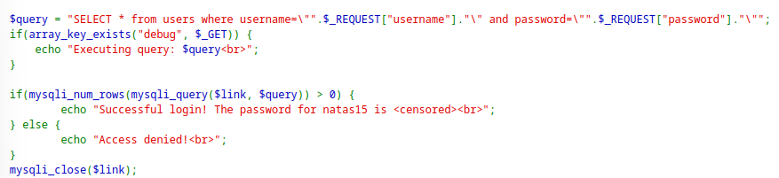
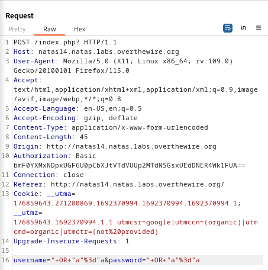
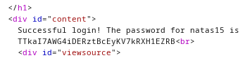
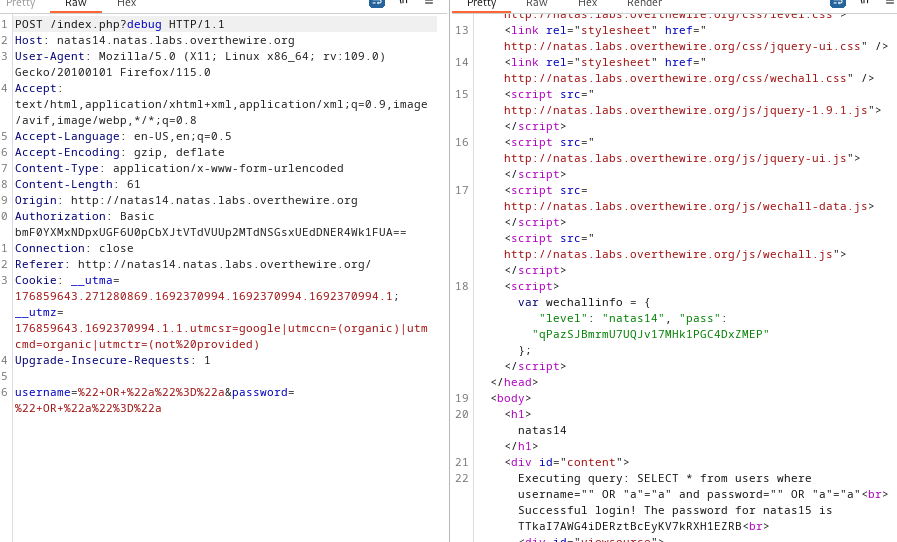

> Analyzing the source code, we see that the query we can inject into gets displayed when the query parameter `debug` exists.
> We don't need to include the `debug` parameter for it work.



> We see also that the password gets printed when the query returns at least 1 row.

> Noticing that the query uses `"`, double quotes not single quotes, then the payload we use should also use these quotes.
> Using the basic payload:

```
" OR "a"="a
```

> And placing it inside the username and password fields.



> The equal sign gets url encoded, but it works without encoding as well.
> Sending this request, we see the password returned.



> To see how our payload was injected, we can add the `debug` parameter as a query parameter and observe the response.



> This query prints everything in the `users` table as all conditions are true.

```
natas15:TTkaI7AWG4iDERztBcEyKV7kRXH1EZRB
```

---
