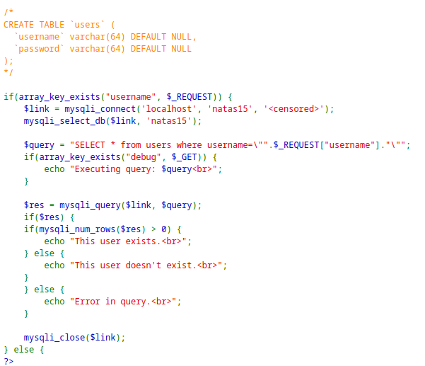
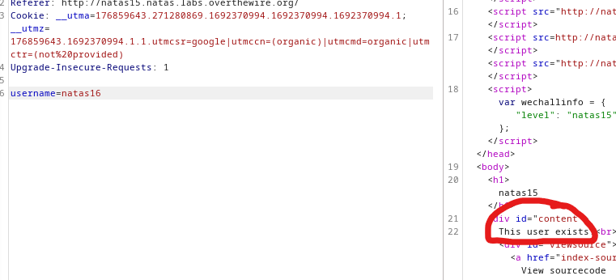
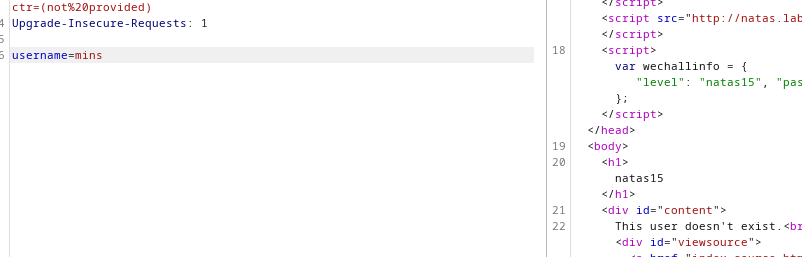
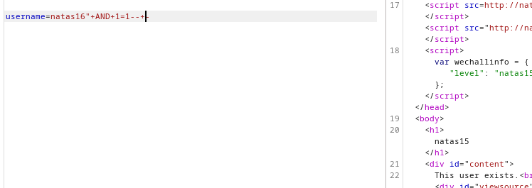
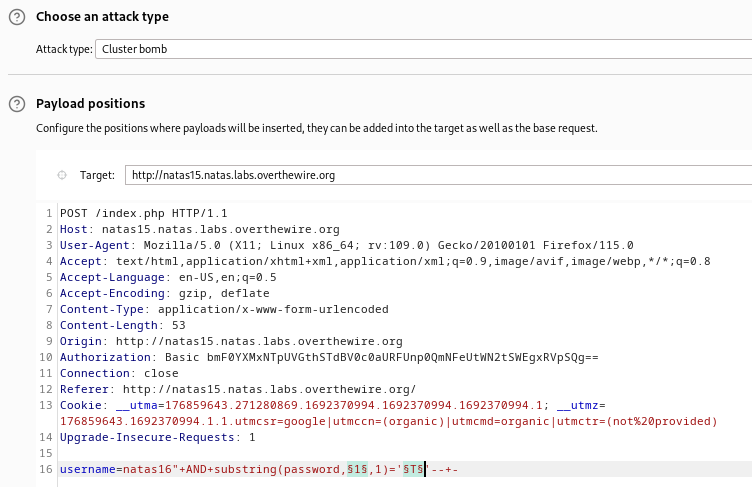
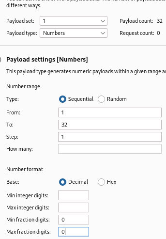
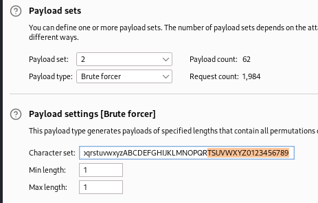
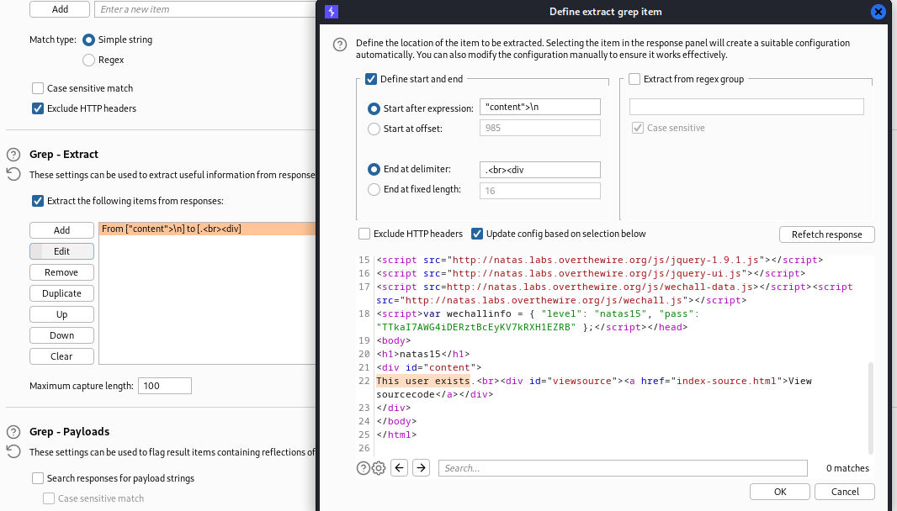
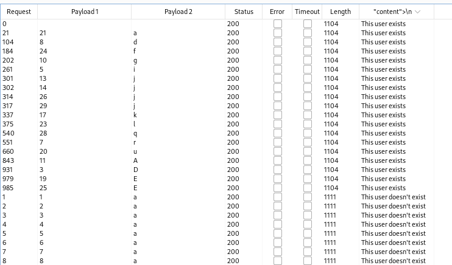

> Viewing the soure code, we see that this is a SQL injection.



> We see there is a `users` table with 2 columns, the username and the password.
> Testing out multiple queries, i see that it is a blind injection, as there is no output except `user exists`, `user doesn't exist`, or `error in query`.
> Therefore, we need to exploit it using blind based attacks.

> If the query returns rows, or the query is true, we see that it prints `user exists`.
> Therefore, we can try to check if the user `natas16` exists.



> If we enter a random string like `mins`, we see that it doesn't exist in the table, meaning the query is false.



> Now, we can use the `AND` technique to check if true/false statements produce the same outputs.
> Checking a true statement first:

```
natas16" AND 1=1-- -
```
> Add the double qoute to escape the input and edit the query directly, and add the comment at the end to ignore the rest.



> If we try the opposite, a false statement:

```
natas16" AND 1=2-- -
```

> We get the false statement, or `user doesn't exist`.

> We can use this to enumerate the details of the password for the `natas16` user.
> First, we can enumerate the length of the password:

```
natas16" AND length(password)=32-- -
```
> Plug this payload into intruder and add a placeholder after the equal sign. Monitor the results for the `user exists` output to check the length of the password.
> The password length is 32.

> Now we can use another intruder attack with this payload to enumerate the characters of the password. 
> We also need to make sure that it is case sensitive, as SQL is case insensitive. Do that using `BINARY`.

```
natas16" AND BINARY substring(password,$$,1)='$$'-- -
```
> The first placeholder has the index, and the second has the character using a clusterbomb attack.



> The first payload is the indices, so let it be all numbers from 1 till 32.



> The second payload is the characters, so let it be all lowercase and uppercase letters, and all digits from 0-9.



> Add a grep extract rule that gets the content of the `div` that holds either `user exists` or `user doesn't exist`.



> Now we can start the attack.



> Now we can see which character at which position works, and we can now build up the password.

```
natas16: TTkaI7AWG4iDERztBcEyKV7kRXH1EZRB
```

---
