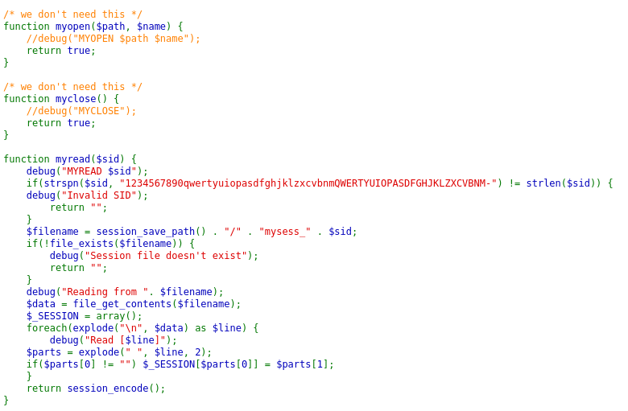
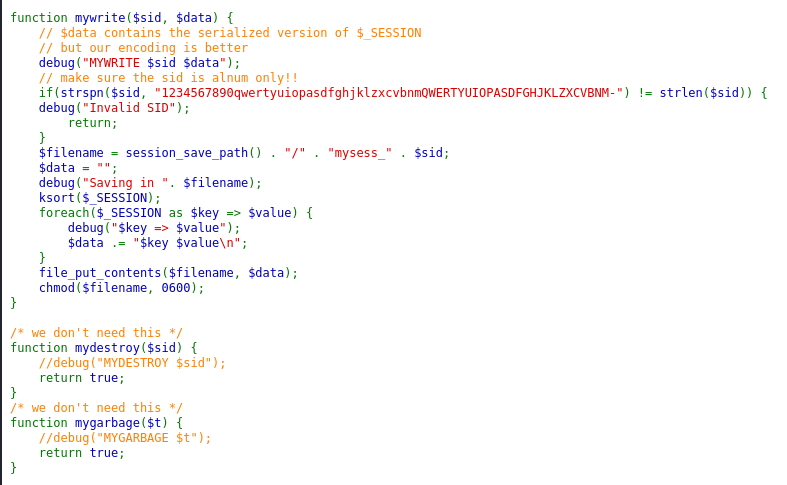
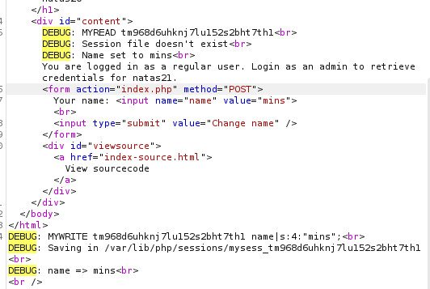
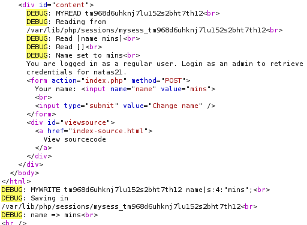
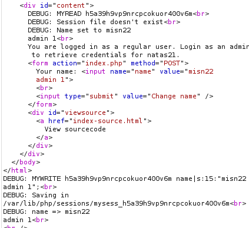
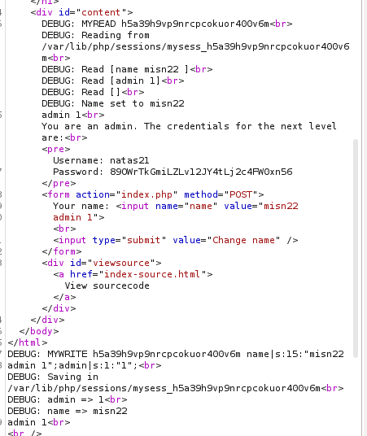

> We see this code in the beginning.

```php
function debug($msg) { /* {{{ */
    if(array_key_exists("debug", $_GET)) {
        print "DEBUG: $msg<br>";
    }
}
/* }}} */
function print_credentials() { /* {{{ */
    if($_SESSION and array_key_exists("admin", $_SESSION) and $_SESSION["admin"] == 1) {
    print "You are an admin. The credentials for the next level are:<br>";
    print "<pre>Username: natas21\n";
    print "Password: <censored></pre>";
    } else {
    print "You are logged in as a regular user. Login as an admin to retrieve credentials for natas21.";
    }
}
/* }}} */
```
> What this does is that if the request is a `GET` request and the `debug` query parameter is added, it prints an extra message. Something useful that we will need.
> We also see the function that prints the admin credentials. It only prints admin credentials if there exists the `admin` key in the session with the value `1`. 
> We need to find a way to insert into the sesion this key-value pair.

> We also see this block of code.

```php
session_set_save_handler(
    "myopen",
    "myclose",
    "myread",
    "mywrite",
    "mydestroy",
    "mygarbage");
session_start();
```

> What this does is that calls all of these functions when any change happens to the session.
> Right after, we start the session, executing these functions.



This function checks that the session_id, or `sid` is alphanumeric. It then creates a file with this value of the `sid` in its name. If the file exists, it then reads from it using the `explode()` function. What this does is separate the file into characters separated by `\n` character. It essentials splits the file into lines. It then prints out each line using the `debug` function. After that, for each line, it splits it into its words separated by spaces, and sets the value of the first word as the `key` in the `session` variable, and sets it `value` to the value of the second word. This means, if we can change the contents of that file to contain the line: `admin 1`, we can bypass the `print` function and print the admin credentials.



This function is what the `myread` function needs to bypass the `print` function, it is where the contents of the file are written. We see that it prints each key value pair in the session variable, and then puts them into the file.


> To start it off, we change the request of the change name function to a `GET` request through burpsuite Repeater, and add the `debug` parameter.
> We set the value of the `name` parameter to any name, `mins`.



> Sending a request, we see that the `myread` function cant see the file created, but `mywrite` creates the same file and prints all key value pairs present, the `name:mins` pair.
> Sending the request one more time, we expect a different output.



> Now we see that the `myread` function can see the file, and printed its contents in key-value form, `name:mins`.
> What this means is there are files being created by the session that are persistent.
> We can exploit this by injecting into these session files, if the input is unsanitized, the `admin:1` key-value pair.
> So if we send it the first time, we create the file, the second time, we inject the key value pair into the file.
> That way, we have injected into the session variables our own values.


###### Exploitation

1. Since the only input we can change is the `name` parameter, and we know that its contents are read by separating into lines, and then splitting into key value pairs by the space, we add this payload:
```
?name=mins22 \nadmin 1
```
> The reason this won't work as the `\n` and the spaces need to be encoded.
> The updated payload:
```
?name=mins22+%0Aadmin+1
```

2. Now if we send the request the first time.


> The first request we see that in the bottom debug for `mywrite()` function, there is a new line added, and a new entry `admin 1`.
> The `myread` function is supposed to create a new key value pair and match it to these values, and then store it in the session variables.

3. Sending it the second time.



> We see that on top, the `myread()` function actually read the two lines. And we see that the exploit worked.
> Since it reads lines separated by the newline character, and sets each line to a key value pair in the session storage, we bypassed it by adding a new line with the needed entry to become admin: `admin 1`.

The credentials for the next level:
```
natas21: 89OWrTkGmiLZLv12JY4tLj2c4FW0xn56
```

---
