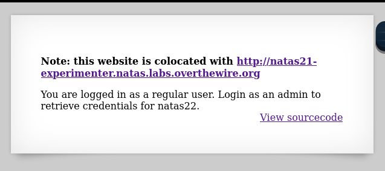
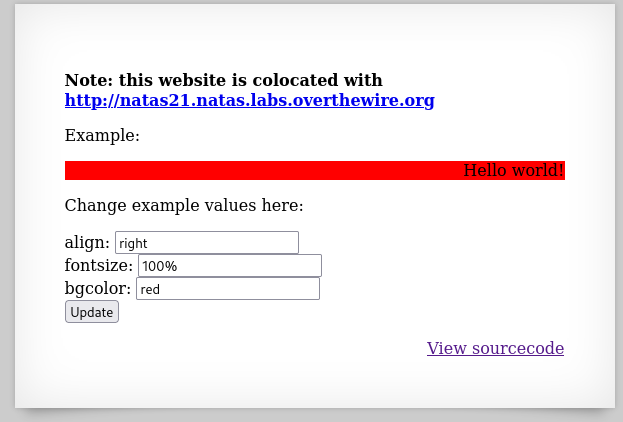
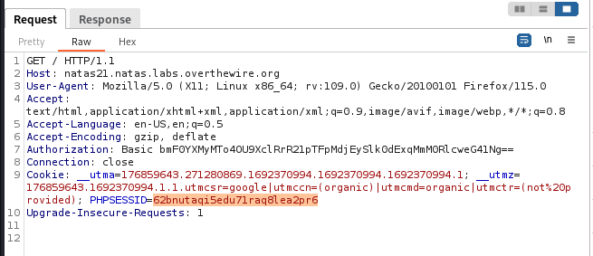
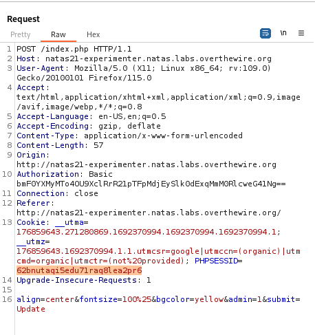
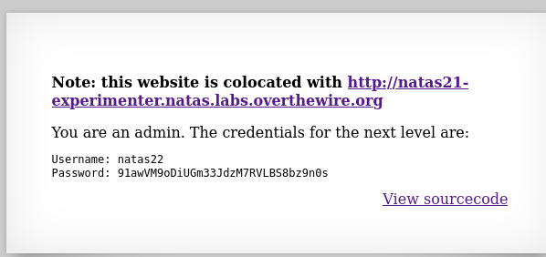

Opening the first page, we see this frontend with this source code:



```PHP
<?php

function print_credentials() { /* {{{ */
    if($_SESSION and array_key_exists("admin", $_SESSION) and $_SESSION["admin"] == 1) {
    print "You are an admin. The credentials for the next level are:<br>";
    print "<pre>Username: natas22\n";
    print "Password: <censored></pre>";
    } else {
    print "You are logged in as a regular user. Login as an admin to retrieve credentials for natas22.";
    }
}
/* }}} */

session_start();
print_credentials();

?>
```

What this code does is that it checks the `session` variables, and if there is a variable called `admin` set to the value 1. If that is the case, it prints out the admin credentials.

> There is another page `experimenter` that we can check. Opening it and checking its source code.



```php
<?php

session_start();

// if update was submitted, store it
if(array_key_exists("submit", $_REQUEST)) {
    foreach($_REQUEST as $key => $val) {
    $_SESSION[$key] = $val;
    }
}

if(array_key_exists("debug", $_GET)) {
    print "[DEBUG] Session contents:<br>";
    print_r($_SESSION);
}

// only allow these keys
$validkeys = array("align" => "center", "fontsize" => "100%", "bgcolor" => "yellow");
$form = "";

$form .= '<form action="index.php" method="POST">';
foreach($validkeys as $key => $defval) {
    $val = $defval;
    if(array_key_exists($key, $_SESSION)) {
    $val = $_SESSION[$key];
    } else {
    $_SESSION[$key] = $val;
    }
    $form .= "$key: <input name='$key' value='$val' /><br>";
}
$form .= '<input type="submit" name="submit" value="Update" />';
$form .= '</form>';

$style = "background-color: ".$_SESSION["bgcolor"]."; text-align: ".$_SESSION["align"]."; font-size: ".$_SESSION["fontsize"].";";
$example = "<div style='$style'>Hello world!</div>";

?>
```

This code checks if a form has been submitted, as it checks if `submit` is present in the `$_REQUEST`. The `$_REQUEST` is used to store the data from a `POST` or `GET` request in key-value pairs. 
It then places all the key-value pairs found in the `$_SESSION` variable as key-value pairs as well.
The remaining part of the code tries to clean or sanitize the input that gets passed to the session variable, but that doesn't happen since the first part already does it.

> This code is an example of code that uses data across multiple pages through the use of `php` sessions. Therefore, we see that the exploit will be adding another `key-value` pair to be submitted in the form, that being `admin=1`. Since it is submitted in the form, it is present in the `$_REQUEST` variable, and hence will be stored in the `SESSION` variable.
> The first page loops over the `SESSION` variable and if `admin=1` is present, it prints the admin credentials. However, both these pages need to have the same `session-id` or cookie to be able to link them.

To exploit this, we need to synchronize both experimter and the original page with the same `phpsessid` cookie value, and then in the experimenter page, add the `admin=1` field.

1. Get the `PHPSESSID` for the first page:



`PHPSESSID=62bnutaqi5edu71raq8lea2pr6`

2. Go to the experimenter page, and add the `admin=1` key to be submitted in the form, and make the `PHPSESSID=62bnutaqi5edu71raq8lea2pr6` to connect the pages.

> Capturing a request to submit the form, we can do these changes.



> Submitting this request, we can check the first page again.

3. Going to the first page and refresh, making sure it has the same session variable, we see the admin credentials printed.



`natas22:91awVM9oDiUGm33JdzM7RVLBS8bz9n0s`

---


