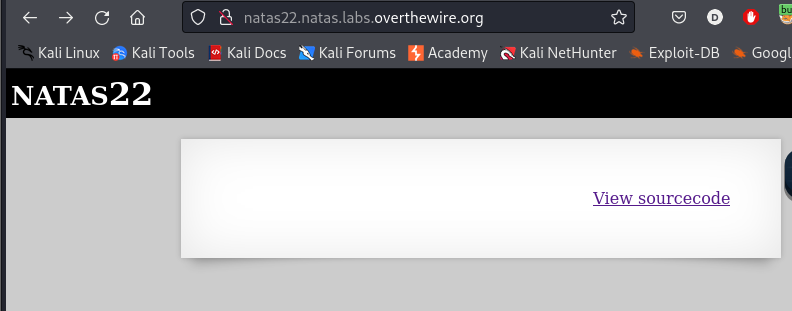

We see nothing on the page, so we check the source code:

```PHP
<?php
session_start();

if(array_key_exists("revelio", $_GET)) {
    // only admins can reveal the password
    if(!($_SESSION and array_key_exists("admin", $_SESSION) and $_SESSION["admin"] == 1)) {
    header("Location: /");
    }
}
?>

<?php
    if(array_key_exists("revelio", $_GET)) {
    print "You are an admin. The credentials for the next level are:<br>";
    print "<pre>Username: natas23\n";
    print "Password: <censored></pre>";
    }
?>
```

The first portion checks if the query parameter `revelio` exists. If it does, and if the session variable doesn't have `admin=1`, then it redirects to the home page.
However, the second portion simply checks if `revelio` query parameter exists. If it does, then it prints the admin credentials.

> Therefore, if we simply include the revelio get parameter in the browser, we are redirected to the home page since we aren't admin.




> But we know that it should print the `admin` credentials since it exists in the session variable. We can use burpsuite to stop the redirect from happening.


> We see that the credentials are printed, and we see that there is a follow redirection button above. If we click it, we are taken to the home page and the admin credentials disappear.
> Therefore, we can snag the credentials from the next level simply by stopping the redirect.

`natas23-qjA8cOoKFTzJhtV0Fzvt92fgvxVnVRBj`

---
