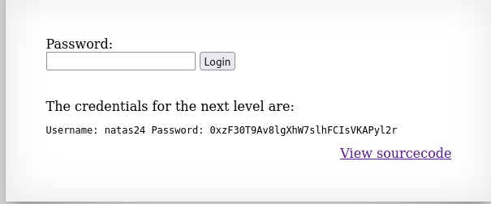

It is simply a prompt asking for the password:


Checking its source code:

``` PHP
<?php
    if(array_key_exists("passwd",$_REQUEST)){
        if(strstr($_REQUEST["passwd"],"iloveyou") && ($_REQUEST["passwd"] > 10 )){
            echo "<br>The credentials for the next level are:<br>";
            echo "<pre>Username: natas24 Password: <censored></pre>";
        }
        else{
            echo "<br>Wrong!<br>";
        }
    }
    // morla / 10111
?> 
```

We see that it checks for the presence of the `passwd` parameter in the `REQUEST` variable. If it has the strig `iloveyou` as a substring and at the same time is an integer value that is greater than 10, it will print the password.

> In PHP, if a string begins with valid numerical data, it is treated as such.
> We can exploit this by putting a number greater than 10 in the beginning of the password string, and then put the `iloveyou` string.

The payload to be placed in the password field is:

```
11iloveyou
```

We get the password for the next level.



`natas24:0xzF30T9Av8lgXhW7slhFCIsVKAPyl2r`

---
