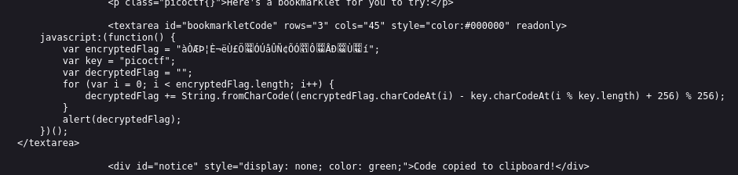
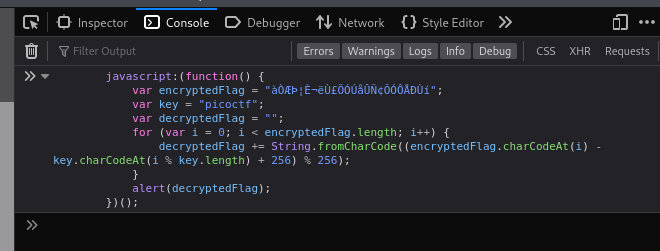
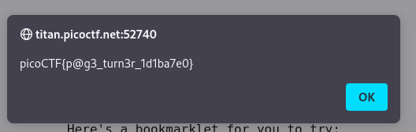

---

Opening the link and checking out the source code, we see a block of JavaScript code that looks like it decodes the content of a string and prints out the flag.



We need to execute this code, so we copy it all, and place it in the console in the developer tools in the browser.



Pressing enter shows an alert on the webpage with the flag.



The flag:

```text
picoCTF{p@g3_turn3r_1d1ba7e0}
```

---
