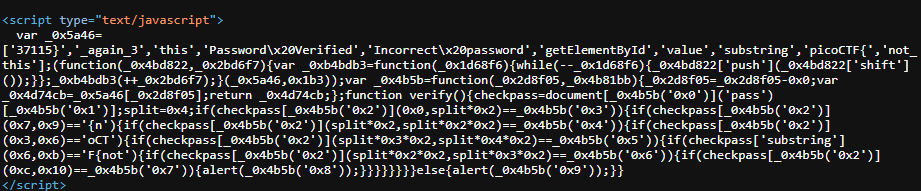
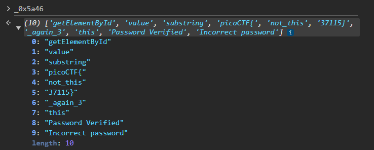

---

Opening the link specified and viewing the source code, we see nothing special except for the obfuscated JavaScript code.



Copying this code to a [JavaScript de-obfuscator](https://deobfuscate.io/) and viewing the output: 

```JavaScript
// THIS IS THE ARRAY OF VALUES.
var _0x5a46 = ["37115}", "_again_3", "this", "Password Verified", "Incorrect password", "getElementById", "value", "substring", "picoCTF{", "not_this"];

// THIS FUNCTION SCRAMBLES THE ARRAY.
(function (_0x4bd822, _0x2bd6f7) {
  var _0xb4bdb3 = function (_0x1d68f6) {
    while (--_0x1d68f6) {
      _0x4bd822.push(_0x4bd822.shift());
    }
  };
  _0xb4bdb3(++_0x2bd6f7);
}(_0x5a46, 435));

// THIS FUNCTION RETURNS THE STRING IN THE ARRAY AT THE GIVEN INDEX.
var _0x4b5b = function (_0x2d8f05, _0x4b81bb) {
  _0x2d8f05 = _0x2d8f05 - 0;
  var _0x4d74cb = _0x5a46[_0x2d8f05];
  return _0x4d74cb;
};

function verify() {
  checkpass = document[_0x4b5b("0x0")]("pass")[_0x4b5b("0x1")];
  split = 4;
  if (checkpass[_0x4b5b("0x2")](0, split * 2) == _0x4b5b("0x3")) {
    if (checkpass[_0x4b5b("0x2")](7, 9) == "{n") {
      if (checkpass[_0x4b5b("0x2")](split * 2, split * 2 * 2) == _0x4b5b("0x4")) {
        if (checkpass[_0x4b5b("0x2")](3, 6) == "oCT") {
          if (checkpass[_0x4b5b("0x2")](split * 3 * 2, split * 4 * 2) == _0x4b5b("0x5")) {
            if (checkpass.substring(6, 11) == "F{not") {
              if (checkpass[_0x4b5b("0x2")](split * 2 * 2, split * 3 * 2) == _0x4b5b("0x6")) {
                if (checkpass[_0x4b5b("0x2")](12, 16) == _0x4b5b("0x7")) {
                  alert(_0x4b5b("0x8"));
                }
              }
            }
          }
        }
      }
    }
  } else {
    alert(_0x4b5b("0x9"));
  }
}

```

It doesn't make much sense, but I see that the function `verify()` seems to be comparing parts of the string and equating it to the flag.

- if `(checkpass[_0x4b5b("0x2")](7, 9) == "{n") {`, This means that the characters from index 7-9 should be `{n`.

> The curly braces usually is placed after `picoCTF`, which takes up indices 0-6, hence, the code of line above must be placed directly after in the string.

Flag until now:
```
picoCTF{n
```

- `if (checkpass[_0x4b5b("0x2")](3, 6) == "oCT") {`, This means that the characters from 3-6 should be `oCT`, which they already are.

- `if (checkpass.substring(6, 11) == "F{not") {`, This means characters from 6-11 should be `F{not`.

Flag until now:
```
picoCTF{not
```

> The remaining portion of the `verify()` function is not comparing directly to strings, but it is comparing substrings to values in the array.

The function `_0x4b5b` is responsible for returning the value of the array at the index that is given as input. For example, here, the index given is `0x3`:
```JavaScript
if (checkpass[_0x4b5b("0x2")](0, split * 2) == _0x4b5b("0x3"))
```
- This line checks whether the substring from `0` to `8` is equal to the third string in the array, which as we can see is `this`.
- We know that the substring is from `0` to `8` because it is from `0` to `split*2`, and it is given that `split=4`.

> This produces a contradiction. We know that the first 9 characters are in fact, `picoCTF{`.

This is the case because there is another function at the top that scrambles the array.
- We can see that it pushes elements into the end of the array 435 times.
```JavaScript
(function (_0x4bd822, _0x2bd6f7) {
  var _0xb4bdb3 = function (_0x1d68f6) {
    while (--_0x1d68f6) {
      _0x4bd822.push(_0x4bd822.shift());
    }
  };
  _0xb4bdb3(++_0x2bd6f7);
}(_0x5a46, 435));
```

> Therefore, we need to figure out at runtime, what the values in the array are after this scrambling. This can be done by printing the array in the web console.



Writing the name of the array in the console, it prints out all the elements in the array in the correct order.
- We see that this now matches, as the 3rd string, `picoCTF{`, is indeed the one from positions `0` to `8`.

Now, we need to complete building the flag using the if conditions in the `verify` function.

- `if (checkpass[_0x4b5b("0x2")](split * 2, split * 2 * 2) == _0x4b5b("0x4")) {`. This checks from substring `8` to `16` that the string equals to the fourth element, which is `not_this`.

Flag until now:
```
picoCTF{not_this
```

- `if (checkpass[_0x4b5b("0x2")](split * 2 * 2, split * 3 * 2) == _0x4b5b("0x6")) {`. This checks the substring from `16` to `24` if it equals the 6th item, which is `_again_3`.

Flag until now:
```
picoCTF{not_this_again_3
```

- `if (checkpass[_0x4b5b("0x2")](split * 3 * 2, split * 4 * 2) == _0x4b5b("0x5")) {`. This checks the substring from `24` to `32` equals to the fifth element, which is `37115}`

Flag until now:
```
picoCTF{not_this_again_337115}
```

---
