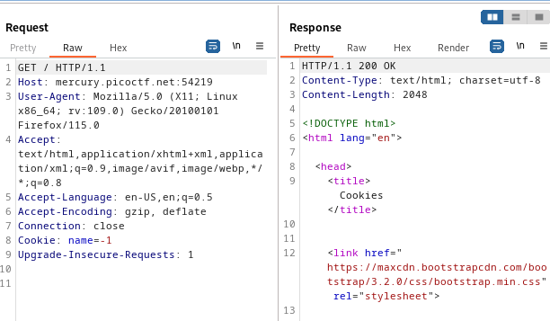
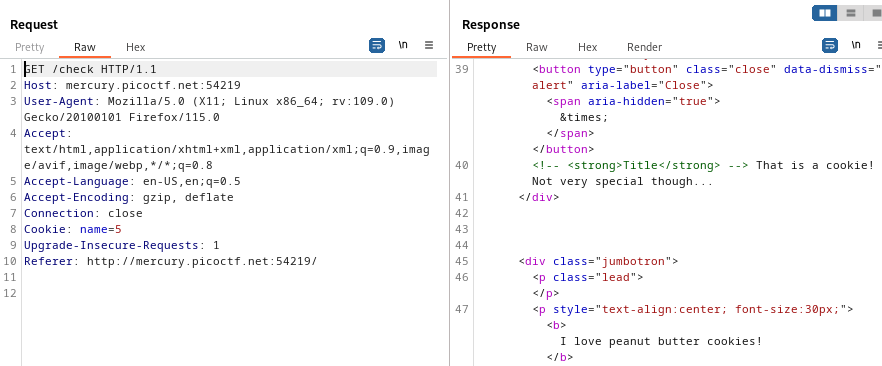
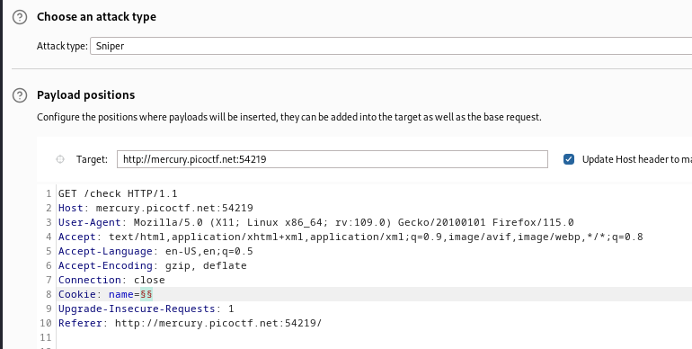
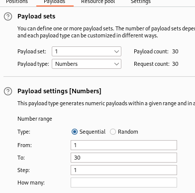
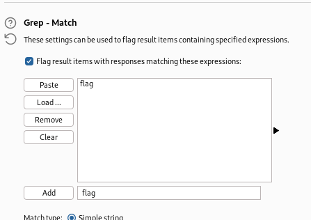
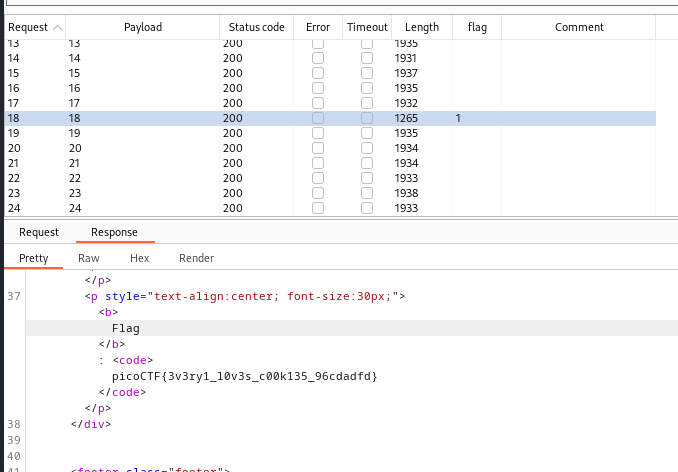

----

> With BURPSUITE PROXY HTTP history open refresh the page and capture the `GET` request.



> We see there is a cookie called `name` with the value of `-1`.
> Try changing the value to different numbers and the response is the same but with a different cookie name.



> So instead of manually trying all the numbers, i went to BURPSUITE INTRUDER for a sniper attack, and set the payload in the cookie value.



> And then set the payloads to be a list of numbers from 1 to 30.



> Then added a grep match rule to look for the flag in the responses.



> Started the attack, and the cookie with the name value of 18 showed a match for the flag.



```
flag: picoCTF{3v3ry1_l0v3s_c00k135_96cdadfd}
```

---
