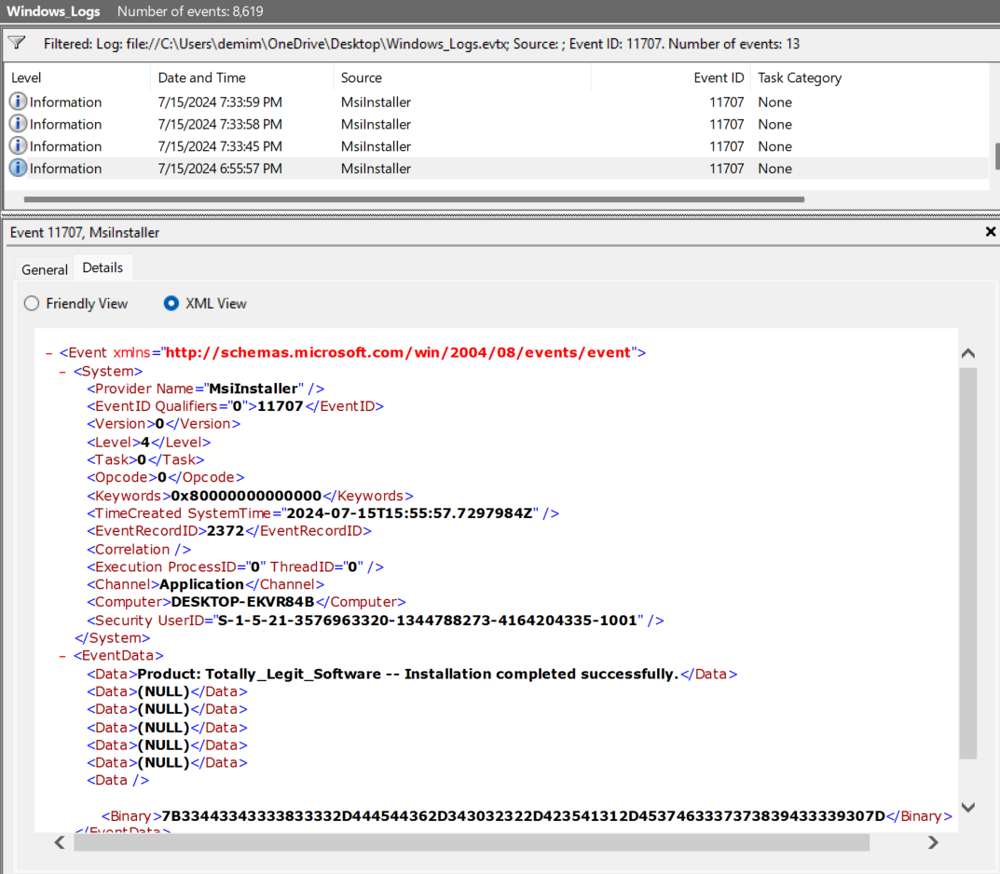
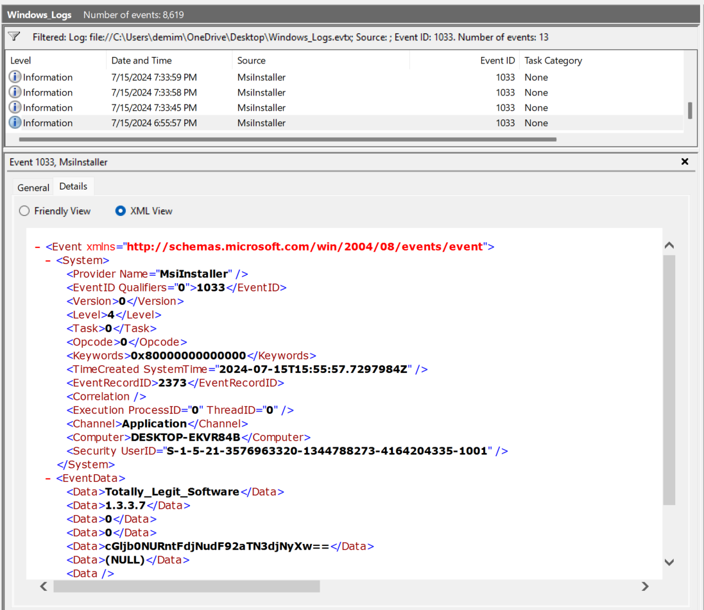
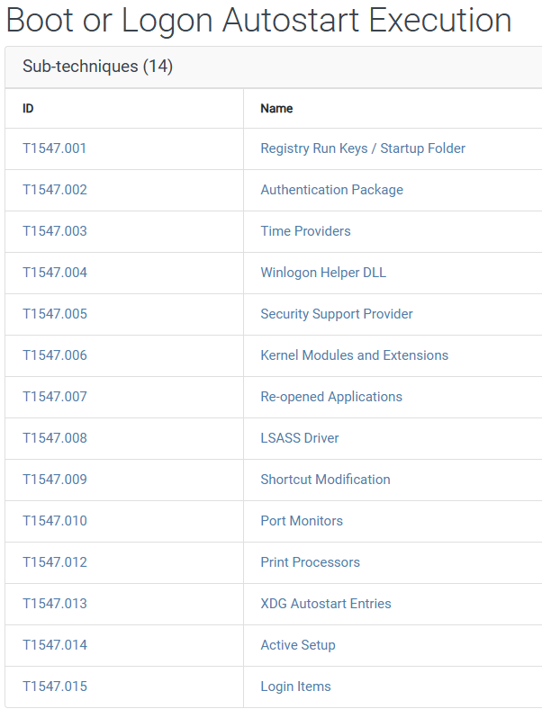
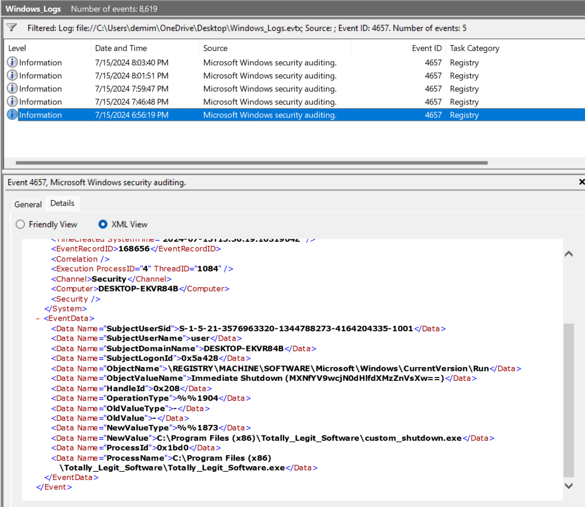
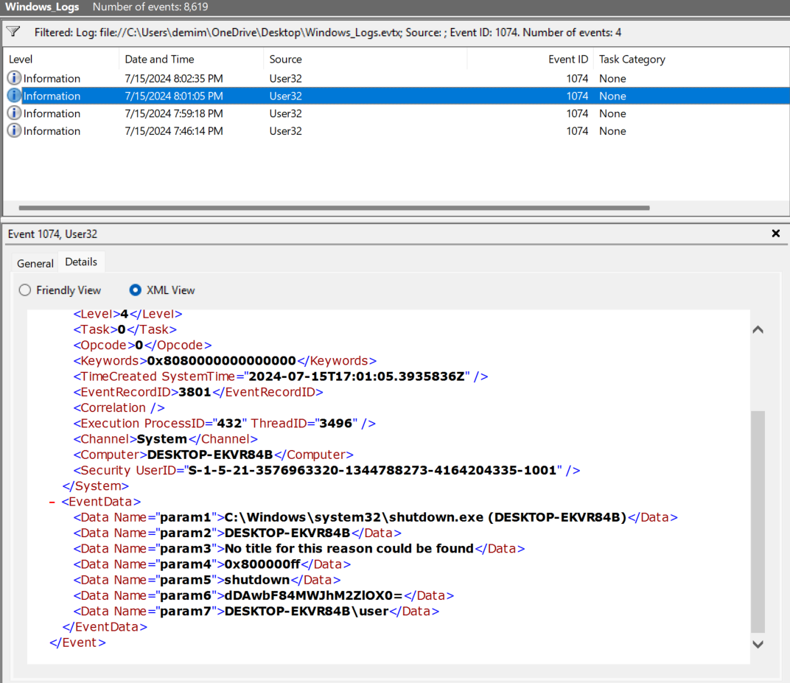

---

Upon downloading the log file, we open it using event viewer and see there are 8619 events to filter on.

The question tell us that the first thing we have to filter on is something being installed. Searching Google for event IDs that are related to installing, we get the ID `11707`.
- Filtering on this ID in event viewer from the Actions tab -> Filter Current Log then adding 11707 in the Event ID, we get 13 events.



The last event, with time `6:55:57` seems fishy as the software is called `Totally_Legit_Software`, but there is no flag.
- We need to find another event that relates to installing, but I do not know the types of event providers present in this log file.

I decided to write a PowerShell script that parses through the entire log file and collects all of the log providers using chatGPT:
- This takes 2 arguments, the input log file and the output text file with the provider names.
```powershell
param(
    [Parameter(Mandatory = $true)]
    [string]$LogPath,

    [Parameter(Mandatory = $true)]
    [string]$OutFile
)

Add-Type -AssemblyName System.Core

# Prepare the query (all events in file)
$query = New-Object System.Diagnostics.Eventing.Reader.EventLogQuery($LogPath, [System.Diagnostics.Eventing.Reader.PathType]::FilePath)

# Reader object
$reader = New-Object System.Diagnostics.Eventing.Reader.EventLogReader($query)

# Open output stream once
$sw = [System.IO.StreamWriter]::new($OutFile, $false, [System.Text.Encoding]::UTF8)

try {
    while ($event = $reader.ReadEvent()) {
        $sw.WriteLine($event.ProviderName)
        $event.Dispose()   # release resources quickly
    }
}

finally {
    $sw.Close()
    $reader.Dispose()
}
```

Then, to print out only the unique providers and in order, we use this python script (also chatGPT):
```python
import argparse

def main():
    parser = argparse.ArgumentParser(description="Extract unique lines from a text file")
    parser.add_argument("input_file", help="Path to the input text file")
    parser.add_argument("output_file", help="Path to the output text file")
    args = parser.parse_args()
    
    providers = set()
    # Read line by line (fast, low memory even if file is huge)

    with open(args.input_file, "r", encoding="utf-8", errors="ignore") as f:
        for line in f:
            providers.add(line.strip())

    # Write unique values back out, sorted for convenience
    with open(args.output_file, "w", encoding="utf-8") as f:
        for name in sorted(providers):
            f.write(name + "\n")
    print(f"✅ Extracted {len(providers)} unique entries to {args.output_file}")

if __name__ == "__main__":
    main()
```

Now, we can run the PowerShell script and specify the input log file and the output file to contain the provider names:
```powershell
.\extract_providers.ps1 .\Windows_Logs.evtx output.txt
```

Now, we can run the python script to extract the providers and list only the unique values:
```bash
python3 .\output.txt unique.txt
```

Now, if we open the `unique.txt` file, we can see the following providers:
```text
BTHUSB
Desktop Window Manager
ESENT
EventLog
Microsoft-Windows-Complus
Microsoft-Windows-DHCPv6-Client
Microsoft-Windows-Dhcp-Client
Microsoft-Windows-Directory-Services-SAM
Microsoft-Windows-DistributedCOM
Microsoft-Windows-EventSystem
Microsoft-Windows-Eventlog
Microsoft-Windows-FilterManager
Microsoft-Windows-GroupPolicy
Microsoft-Windows-HAL
Microsoft-Windows-Kernel-Boot
Microsoft-Windows-Kernel-General
Microsoft-Windows-Kernel-Power
Microsoft-Windows-Kernel-Processor-Power
Microsoft-Windows-MSDTC
Microsoft-Windows-MSDTC 2
Microsoft-Windows-Ntfs
Microsoft-Windows-RestartManager
Microsoft-Windows-Search
Microsoft-Windows-Security-Auditing
Microsoft-Windows-Security-SPP
Microsoft-Windows-TPM-WMI
Microsoft-Windows-User Profiles Service
Microsoft-Windows-WMI
Microsoft-Windows-Wininit
Microsoft-Windows-Winlogon
MsiInstaller
SecurityCenter
Service Control Manager
User32
VMTools
VMUpgradeHelper
VSS
Windows Error Reporting
e1i65x64
edgeupdate
vmci
Microsoft-Windows-Eventlog
```

Scrolling through, we see the `MsiInstaller` provider, sounds like something that would install something.
- Doing a quick Google search, we see that it is a Windows system service and technology for managing software installations, updates, and uninstalls.
- Opening the list of [event IDs](https://learn.microsoft.com/en-us/windows/win32/msi/event-logging), we see event ID `1033` for  installations.

Filtering for this event and going to the same time, we get the same event but this time with some data.



We see there is some base64 data, decoding using CyberChef we get the first part of the flag:
```
cGljb0NURntFdjNudF92aTN3djNyXw== : picoCTF{Ev3nt_vi3wv3r_
```

Then, the question says that every time they login, something happens. This attack technique has something to do with automatic execution on logon.
- Searching on MITRE in the persistence tactic, we see the following [*boot or logon autostart execution*](https://attack.mitre.org/techniques/T1547/):



We see that one technique is modifying the registry keys, opening it and reading through, we see that attacker can modify some registry keys to execute scripts once the computer starts.
- Scrolling down to the *detection* section, we see that it can be detected by looking for events that log changes in the windows registry.
- There is a windows event log event with ID `4657` that logs changes in the registry.

Filtering for this event ID and scrolling to the time near when the installation event was logged, which was around `6:55:57`



We see that there was a modification to the `\currentVersion\Run` key which is used in startup automatic executions as stated in MITRE.
- We also see some base64 data that we can decode.

```
MXNfYV9wcjN0dHlfdXMzZnVsXw== : 1s_a_pr3tty_us3ful_
```

Now, we need to find something related to shutdown events.
- Doing a quick google search, we see that shutdown event is logged using the `1074` event ID.

Filtering on this event ID:



We see the shutdown event, and we see the provider is `User32`, and we see the base64 encoded data:

```
dDAwbF84MWJhM2ZlOX0= : t00l_81ba3fe9}
```

We have all parts of the flag:

```
picoCTF{Ev3nt_vi3wv3r_1s_a_pr3tty_us3ful_t00l_81ba3fe9}
```

---
