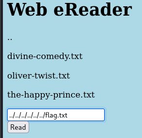
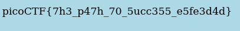

---

The challenge tells us that we can read files, and the current directory that the website shows its files is the `/usr/share/nginx/html/`.
- To be able to read the `/flag.txt` file in the root directory, we need to jump back 4 directories.

```bash
../../../../flag.txt
```



Pressing read, we see the flag.



```text
 picoCTF{7h3_p47h_70_5ucc355_e5fe3d4d}
```

---
