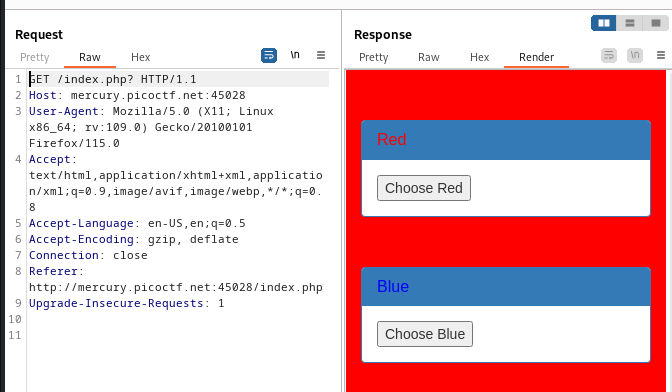
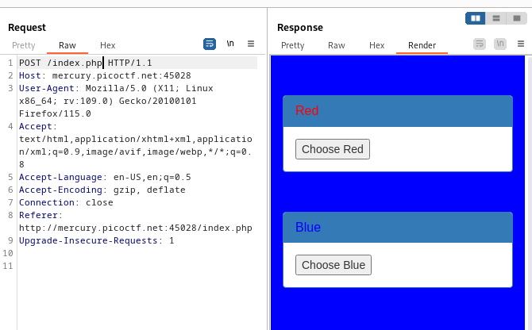
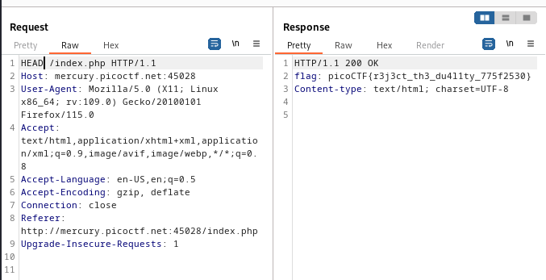

----

> With BURPSUITE PROXY HTTP history open.
> Click on the two options.

> When we choose red this is the request and the response.



> When we choose blue this is the request and the response.



> The only difference between the two requests is the HTTP verb used.
> Trying the other verb `HEAD` we see the flag.



```
flag: picoCTF{r3j3ct_th3_du4l1ty_775f2530}
```

---
