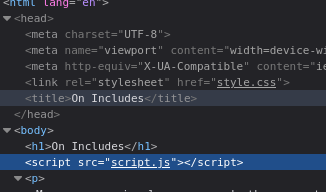

> Inspecting the source code, there are 2 other files being included.
> The `styles.css` and the `script.js`.



> Opening the `style.css` we see the first part of the flag.

```
picoCTF{1nclu51v17y_1of2_
```

> Opening the `script.js` we see the second part of the flag.

```
f7w_2of2_df589022}
```

---
