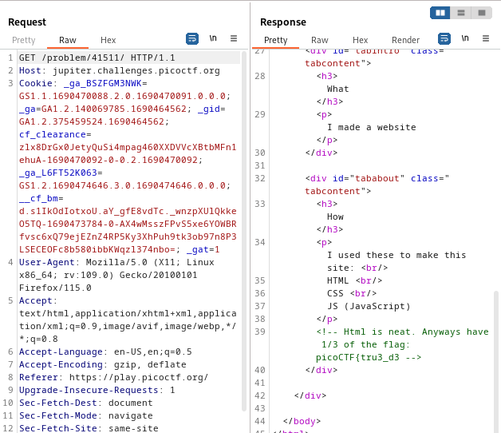
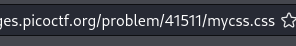
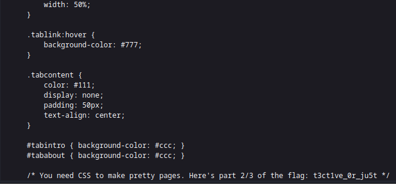
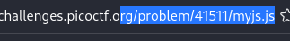
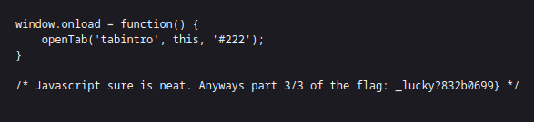

----

> With BURPSUITE PROXY HTTP history open.

> Refresh the first page and look at the response.
> Find in a comment the first part of the flag.



>PART 1
```
picoCTF{tru3_d3
```

> Then scanning through the source code of this response, i see linked a CSS file: `mycss.css`.
> Going to that file and opening it and scrolling down is the second part of the flag.





> Part 2
```
t3ct1ve_0r_ju5t
```

> Finally, i go the linked js file found in the source code: `myjs.js`.



> Found at the bottom is the last part of the flag.



> PART 3
```
_lucky?832b0699}
```

> Combining the 3 parts for the flag.

```
flag: picoCTF{tru3_d3t3ct1ve_0r_ju5t_lucky?832b0699}
```

---

