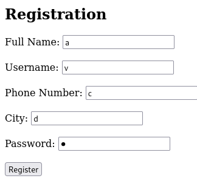
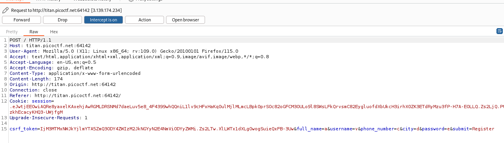
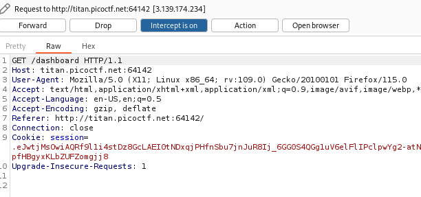
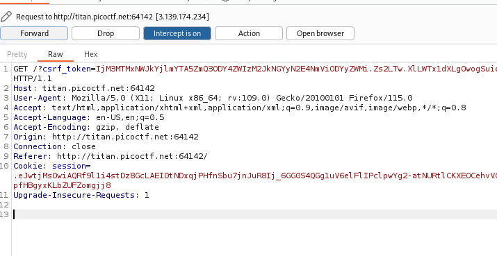
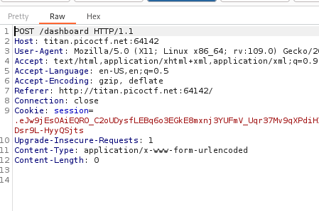
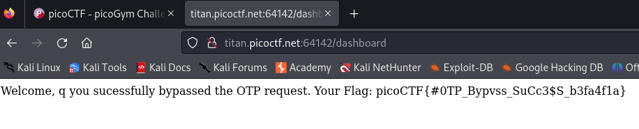

---

With BURPSUITE Intercept proxy on, fill out the information in the webpage and press register.

Capturing this request in the proxy tab:

We see that it is sending the information filled out normally.
- So we forward this request, by clicking on the forward button on top, and we see another request being sent.

This request fetches the dashboard, which if we take a look at after forwarding, we see that it is requesting the value of an OTP that we do not possess.
- Any number you enter will not work.

> From the hint, we see that the server side doesn't handle malformed requests.

So we can try to change the request method to `GET` if it is `POST`, or `POST` if it is `GET` to see how the server responds.
- This can be done by right clicking on the request in the proxy tab, and clicking on `change request method`.

1. Change the request method of the first `POST` request that allows us to register.

Forwarding this request, we are redirected to the same page again. Hence, we can try another request.

2. Change the request of the `GET` method that fetches the dashboard page where we are supposed to enter the OTP.

Forwarding this new request, we see that have bypassed the page that makes us enter the OTP, and we are presented with the flag.

The flag: `picoCTF{#0TP_Bypvss_SuCc3$S_b3fa4f1a}`.

---
