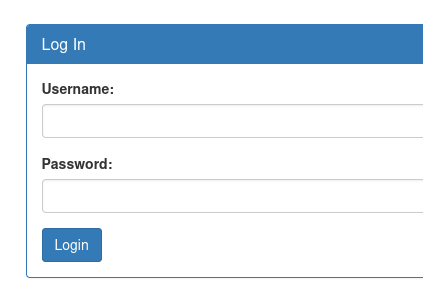
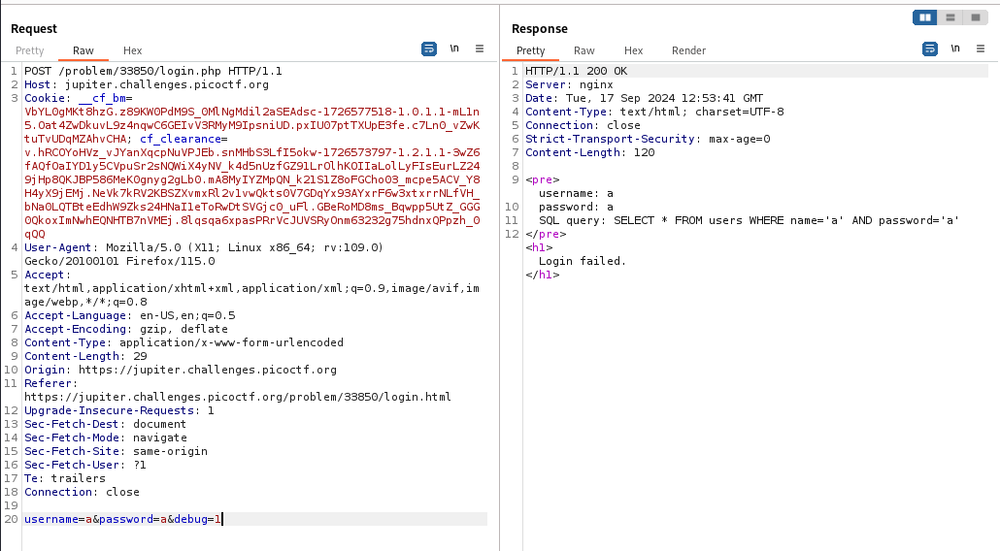

---

Opening the link of the website and browsing through, we see a navigation panel on the left, and an admin panel login.



With Burp Suite Proxy HTTP History on, we try to login and observe the request that is sent.


We see that the username and password are being sent, along with a parameter called `debug` and set to 0.
- Sending this request to Repeater, and changing the value of `debug` to 1, we see something special.



We see that there is an SQL query being used, so we directly shift gears to SQL injection.
- Inserting the famous payload `' or 1=1-- -` in the username parameter in the request.

> Make sure to URL encode the spaces in this payload such that it is handled properly.

```SQL
'+or+1=1--+-
```


We see that w have logged in, and the flag is returned.

```text
picoCTF{s0m3_SQL_f8adf3fb}
```

---
