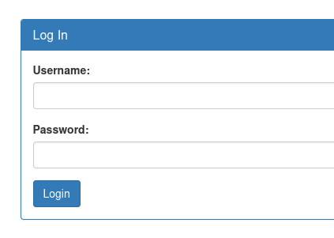
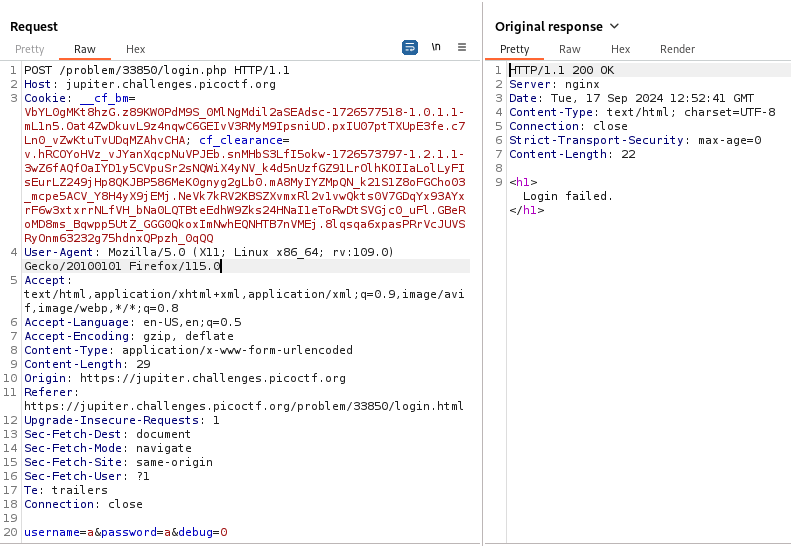
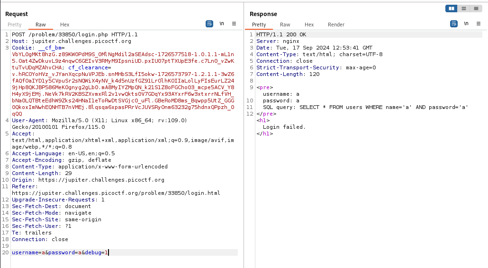
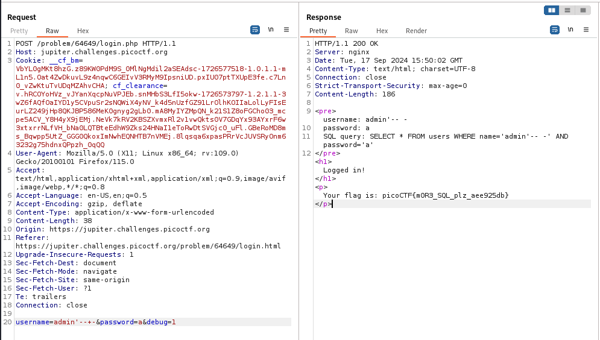

---

Opening the link of the website and browsing through, we see a navigation panel on the left, and an admin panel login.



With Burp Suite Proxy HTTP History on, we try to login and observe the request that is sent.



We see that the username and password are being sent, along with a parameter called `debug` and set to 0.
- Sending this request to Repeater, and changing the value of `debug` to 1, we see something special.



We see that there is an SQL query being used, so we directly shift gears to SQL injection.

> After trying multiple famous payloads, it turns out that there is a filter placed that can detect keywords like `OR` and `UNION`.

Therefore, after reading the question again, it states that we should try logging in as admin, but we do not know the password.
- So I tried this simply payload to end the query right after entering the username.

```SQl
admin'-- -
```



We see that it works, and the flag is output.

```text
picoCTF{m0R3_SQL_plz_aee925db}
```

---
