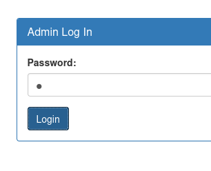
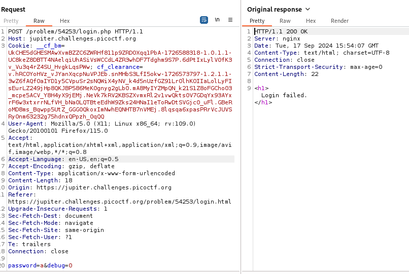
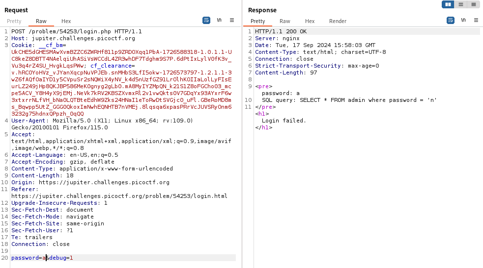
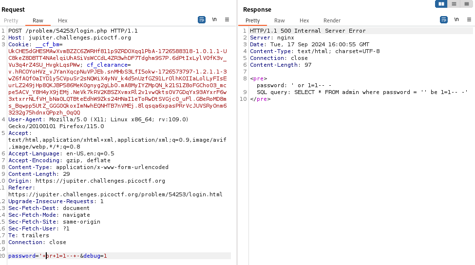
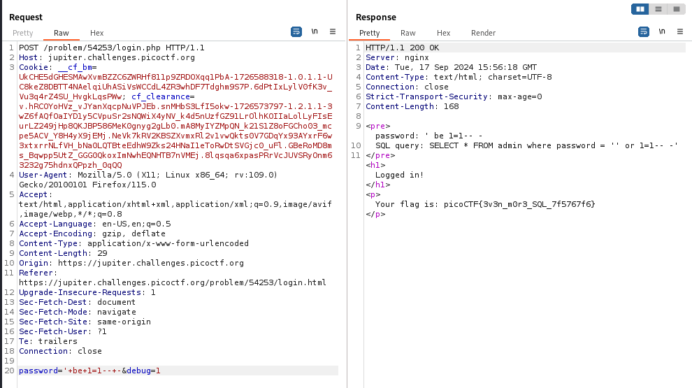

---

Opening the link of the website and browsing through, we see a navigation panel on the left, and an admin panel login.



With Burp Suite Proxy HTTP History on, we try to login and observe the request that is sent.



We see that the password is being sent, along with a parameter called `debug` and set to 0.
- Sending this request to Repeater, and changing the value of `debug` to 1, we see something special.



We see that the password is being sent, but it is being interpreted as something else.
- The `a` gets transformed to an `n`, which is 13 characters away.
- If we try another character, for example, `b`, we see that it outputs `o`.

> therefore, every character that is entered is shifted 13 to the right, which corresponds to a 13 key Caesar cipher.

In order to produce the payload we want, which is `' or 1=1-- -`, we need to check how we can input it such that it is interpreted as that exact set of characters.
- Trying it first in Repeater to see how it looks.
- Make sure to URL encode the spaces to `+`.



> Only the alphabet's characters are replaced, not the numbers, or signs, and they were replaced by the characters that are exactly 13 spaces away.

So, we need to replace the `or` with two characters that when shifted by 13 to the right, produce `or`, which are `be`, as produced by the response message. 

Changing the payload:

```
'+be+1=1--+-
```



We see that the flag is produced.

```text
picoCTF{3v3n_m0r3_SQL_7f5767f6}
```

---
