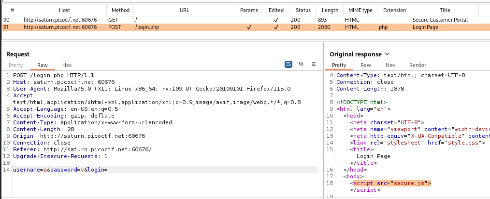

---

With Burp Suite HTTP History tab open, try logging in to the website.



We see that when we login, we post our username and password to the `login.php` page.
- Inside that page, there is a script called `secure.js` that seems interesting.

Giving this page a visit by viewing the source code of the `login.php` page and clicking on it, or by simply entering its path:
```
<lab-link>/secure.js
```

We see that it has a function called `checkPassword` that checks whether the input username and password are correct:


Therefore, we see that the username is `admin`, and the password is `strongPassword098765`.
- Using these to log in shows us the flag.

```text
picoCTF{j5_15_7r4n5p4r3n7_05df90c8}
```

---
