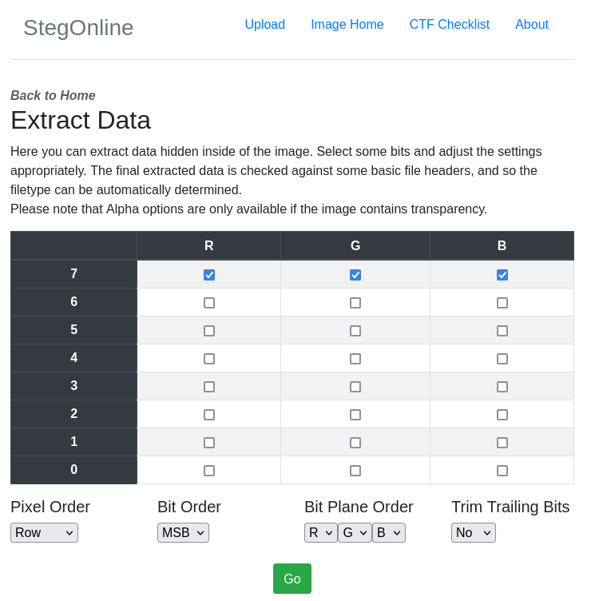

---

Downloading the image and knowing from the challenge title that it uses MSB steganography, we can try to decode the *Most Significant Bit* of each pixel in the image.
- This can be done using this online tool: [StegOnline](https://georgeom.net/StegOnline/extract)

We choose to extract hidden files and data, and then we select the Most Significant Bits for each column:



Pressing Go, we are presented with output textual data.
- Downloading the textual data we can see the flag in the text.

```
picoCTF{15_y0ur_que57_qu1x071c_0r_h3r01c_572ad5fe}
```

---

