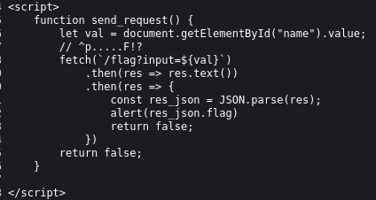
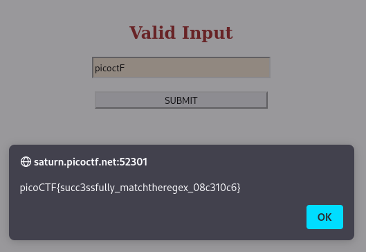

---

Opening the webpage and viewing the source code, we see that there is a function that will return the flag for us.



The flag is fetched from a page called `/flag` and it takes with it an input query parameter called `input` with the value from the input box called `name`.
- Hence, the flag is called from a page taking a parameter that we do not know its value, and brute forcing it would be hard.

However, there is a comment with the following values, which seems like it means something:
```text
^p.....F!?
```

After asking chatGPT, it turns out this is regex, it is basically a technique that is used to match strings, and this is what it told me:

> This regex matches any string that starts with "p", followed by any five characters, then the character "F", and optionally followed by an exclamation mark "!".

Therefore, lets try entering into the input field a string that matches these properties:
```text
picoctF
```



Once we enter the value and hit submit, the page containing the flag is fetched and its value is printed to us:

```text
picoCTF{succ3ssfully_matchtheregex_08c310c6}
```

---
