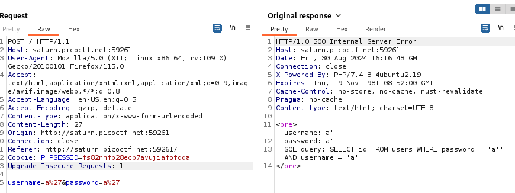
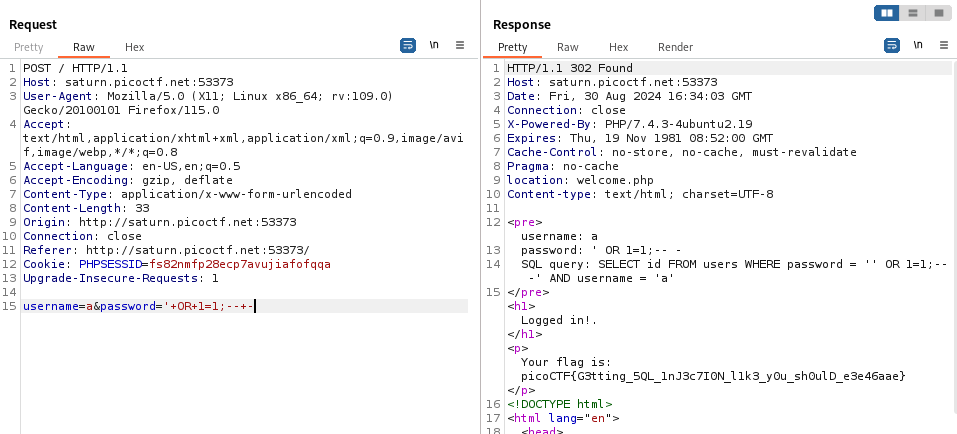

---

Upon opening the website and having Burp Suite HTTP History tab open, try logging in with `a'` for both username and password to test if these parameters are vulnerable to SQL injections.



We can note several things:
1. The server responds with an error using a code of `500`.
2. The server responds with the exact SQL query that is used to login.

> Therefore, we can use this information to form the correct payload to successfully exploit the SQL injection. Once it's found, we can reuse this `POST` request to login with it and obtain the flag.

To perform the injection, we need to escape from the string that holds the input value for the `password` parameter.
- I chose the password parameter because it is the first one in the query. It doesn't matter which one to put the payload in.

1. Escape the `' '` that holds the value for the password parameter by adding an extra `'`, changing the query to look like this:
```SQL
SELECT id FROM users WHERE password = ''' AND username = ''
```

> We see that when we added the single quote inside the input parameter, there is now an extra quote that needs closing, and the remaining portion of the query is treated as a string which is incorrect. This will result in a syntax error if left like this, which is the reason why the server responded with status code of `500` and returned an error.

2. Now that we escaped from the string, we can try adding normal SQL syntax to print the rest of the table contents. We can now combine the `'` with this statement ` OR 1=1;` such that the query evaluates to true and returns the required information.
```SQL
SELECT id FROM users WHERE password = '' OR 1=1;' AND username = ''
```

> We see that if we read the query from left to right, it is now equivalent to saying return the `id` from the `users` table that has an empty password `OR` 1=1. The Boolean operation `password='' OR 1=1` always evaluates to true since 1=1, and the OR operator requires only one side of the equation to be true. Therefore, this SQL statement evaluates to true, and the `SELECT` statement will return the information. However, there is still another issue as the remaining portion of the SQL query is still not syntactically correct.

3. To fix the syntax of the query after we performed the injection, we can simply comment out everything else after what we entered using this syntax: `-- -`.
```SQL
SELECT id FROM users WHERE password = '' OR 1=1;-- -' AND username = ''
```

Now, we see that the entire payload entered between the two quotes of the password parameter is the following:
```SQL
' OR 1=1;-- -
```
- This payload escaped from the string of the password, added a Boolean condition that evaluates to true, and then comments out the rest of the statement.

> To send this payload, we can either put it in the password field of the website and observe the response, or use Burp Suite repeater to send it (the cooler way).

To send it using Repeater, we need to use the `POST` request for logging in, and place this payload in the password field.
- When sending the payload in the repeater, we need to remove the spaced and add the `+` sign such that the payload is interpreted as one string. This is called URL encoding, or using a format that is supported while sending data using HTTP.



After sending the request with the payload, we see that we did manage to log in, as the query now returns true, and the challenge is solved giving us the flag:

```text
picoCTF{G3tting_5QL_1nJ3c7I0N_l1k3_y0u_sh0ulD_e3e46aae}
```

---
