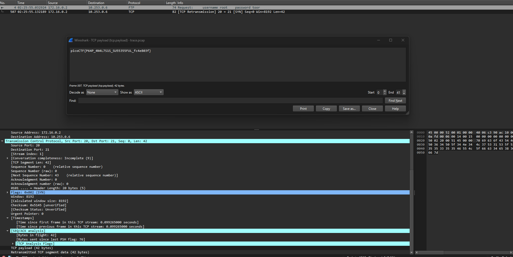

---

Opening the `pcap` file, we see a lot of packets with nothing striking out.
- I decide to open the Statistics tab then open the connections tab to see some interesting data I can pivot from.

Heading to the TCP tab, we see the connection size in Bytes, with only these 4 sizes:
- 40 bytes
- 80 bytes: only 1
- 124 bytes
- 156 bytes: only 1

The ones that are interesting to me are the ones with only 1 connection.
- Clicking on the connection with 156 bytes and choosing apply filter, we see that we get 2 packets.

The second packet, with number 507 has a TCP payload with 42 bytes.
- Right clicking on choosing show packet, we see the flag.



```
picoCTF{P64P_4N4L7S1S_SU55355FUL_fc4e803f}
```

---