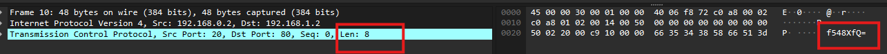

---

First thing we do after downloading the pcap file is reorganize by time to ensure that the packets are displayed in the correct order:


Now, we can inspect the packets.
- We see there are mainly 2 types of packets, ones with length 8 and ones with length 12.
- Going over the packets, we see that they contain data at the very end.

Any packet with length 8 has 8 characters in data at the end:


Trying to decode this data we get nothing useful.
- Right clicking on the packet and choosing `show packet bytes` or clicking `CTRL+SHIFT+O` then playing with the decoding options we get nothing useful.

However, packets with length 12 have 12 characters in data at the end, and they resemble Base64 encoded strings:
- This also includes the packet number 6 that says `TCP Out-Of-Order`. It also has length 12.


This looks like Base64 because:
- Ends in 2 equal signs.
- Length is a multiple of 4.

Trying to decode this in the `show packet bytes` panel, we get the following:
```
cGljb0NURg== : picoCTF
```

This sets the pattern, so let's decode all packets with length 12 from base64:
- The last packet with length 4 also shows the same characteristics for Base64 encoded strings.

```
cGljb0NURg== : picoCTF
ezF0X3c0cw== : {1t_w4s
bnRfdGg0dA== : nt_th4t
XzM0c3lfdA== : _34sy_t
YmhfNHJfZg== : bh_4r_f
MzE4ZGIyMg== : 318db22
fQ== : }
```

This gives us the flag:
```
picoCTF{1t_w4snt_th4t_34sy_tbh_4r_f318db22}
```

---
