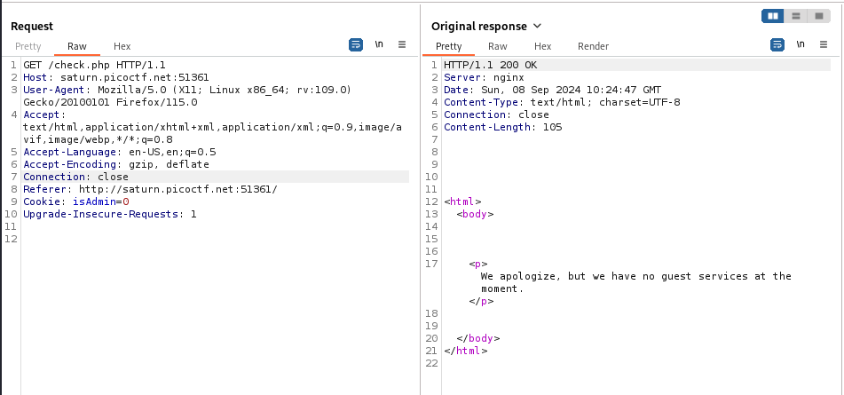
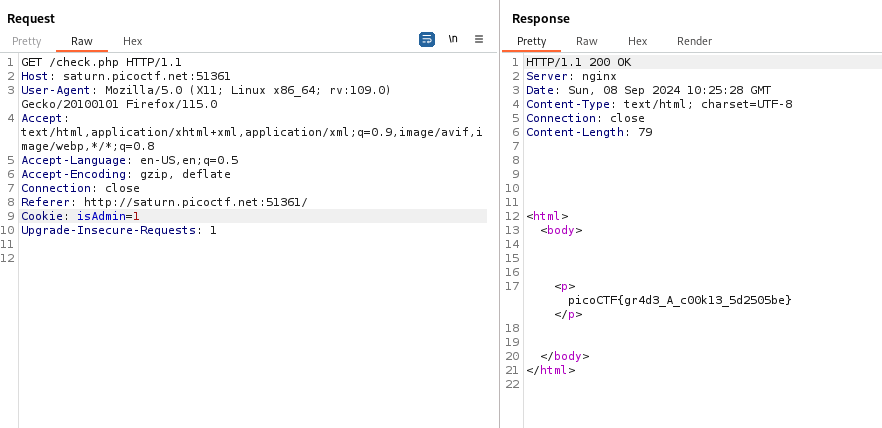

---

With Burp Suite Proxy HTTP History tab open, open the website and press on the button to continue as guest.

> We see that we get an error, that we do not have guest services.



Taking a closer look at the request, we see that there is a cookie:
```text
Cookie: isAdmin=0
```

> We can send it to repeater, and then change the value from 0 to 1.



The flag is returned:

```text
picoCTF{gr4d3_A_c00k13_5d2505be}
```

---
