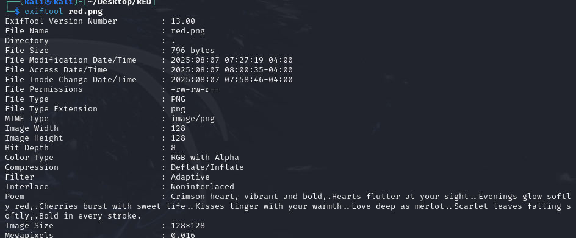
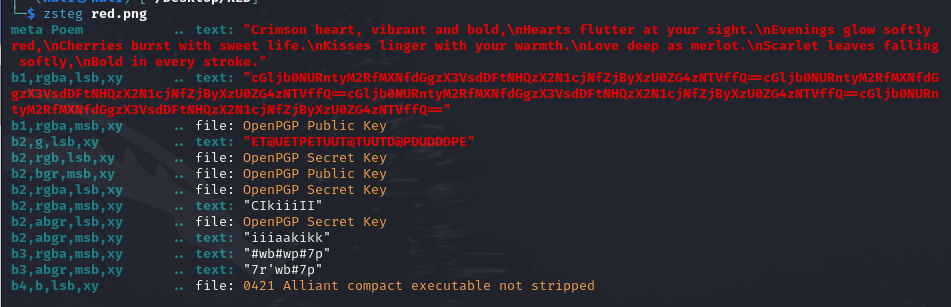

---

After downloading the file, we can use the `exiftool` to get information about the metadata of the image:
```bash
exiftool red.png
```



We see nothing interesting except the `Poem`, but no flag.

Trying the `zsteg` tool which can be downloading using `sudo gem install zsteg`:
```
zsteg red.png
```



We see a base64 string : `cGljb0NURntyM2RfMXNfdGgzX3VsdDFtNHQzX2N1cjNfZjByXzU0ZG4zNTVffQ==`

Decoding it, we get the flag:
```bash
┌──(kali㉿kali)-[~/Desktop/RED]
└─$ echo "cGljb0NURntyM2RfMXNfdGgzX3VsdDFtNHQzX2N1cjNfZjByXzU0ZG4zNTVffQ==" | base64 -d
picoCTF{r3d_1s_th3_ult1m4t3_cur3_f0r_54dn355_}
```

---
