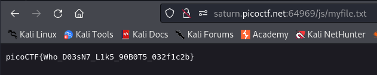

---

Opening the website, and following the hint, nothing out of the ordinary is present in the source code or the pages themselves.
- Based on a concept I learned in the [[Search Source]] CTF, I cloned the entire website.

```bash
wget -m http://saturn.picoctf.net:64969
```

Scanning through the downloaded directory, I found the `robots.txt` file and opened it:

```text
User-agent *
Disallow: /cgi-bin/
Think you have seen your flag or want to keep looking.

ZmxhZzEudHh0;anMvbXlmaW
anMvbXlmaWxlLnR4dA==
svssshjweuiwl;oiho.bsvdaslejg
Disallow: /wp-admin/       
```

I tried opening the `cgi-bin` and `wp-admin` files, but got blocked.

> Notice how there is an equal sign in the bottom chunk, which most likely indicates base64 encoding.

Base64 decoding the text:

```text
ZmxhZzEudHh0              => flag1.txt
anMvbXlmaWxlLnR4dA==      => js/myfile.txt
```

Opening the 2 files:
- The `flag1.txt` gets me blocked
- The `js/myfile.txt` when opened prints the flag.



The flag:

```text
picoCTF{Who_D03sN7_L1k5_90B0T5_032f1c2b}
```

---
