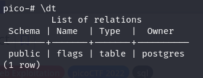
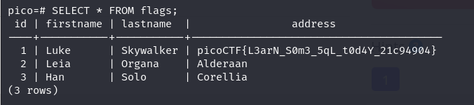

---

Using the command provided, connect to the PostgreSQL server and enter the password.

```bash
psql -h saturn.picoctf.net -p 52783 -U postgres pico

postgres
```

Once in, we can check the tables (relations) by using `\dt`:



We see there is a table called flags, so we can select everything from it:

```sql
select * FROM flags;
```



We see the flag:

```text
picoCTF{L3arN_S0m3_5qL_t0d4Y_21c94904}
```

---
