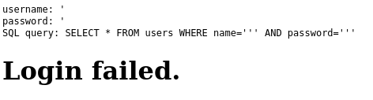
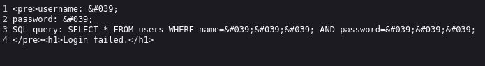
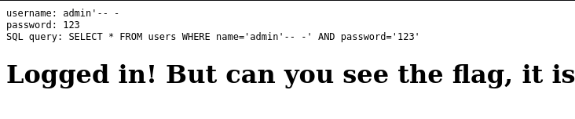
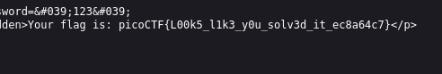

---

Opening the website, we see a username and password input field.
- Testing for SQL injections, we place the `'` single quote payload in both fields and inspecting the output.



We see that the query is output, but there are no errors produced even when the syntax seems wrong.
- This means the quote maybe didn't escape from the input string, likely a WAF in place the prevents us from injecting special characters in the input.



> Inspecting the page, we see that the quotes are HTML encoded.

Taking the hint from the website, it tells us that we should try logging in as the `admin` user, so this is the payload I used:

```sql
admin'-- -
```
- The quote is used to close the string, and the comment `-- -` is used to delete everything else after it in the query.



We see that it worked, weirdly, given that the quotes are encoded.
- However, the comments are not encoded, which is maybe why it worked.

We can then obtain the flag by inspecting the source code of the page.



```text
picoCTF{L00k5_l1k3_y0u_solv3d_it_ec8a64c7}
```

---
