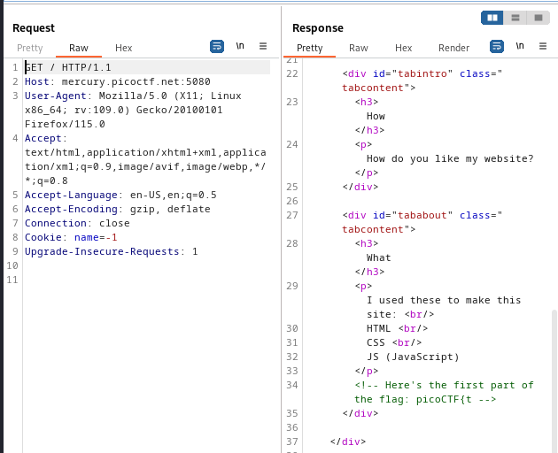
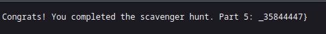

----


> With BURPSUITE PROXY HTTP history open.

> Refresh the first page and look at the response.
> Find in a comment the first part of the flag.



> PART 1
```
picoCTF{t
```


> Then scanning through the source code of this response, i see linked a CSS file: `mycss.css`.
> Going to that file and opening it and scrolling down is the second part of the flag.


> PART 2
```
h4ts_4_l0
```


> Finally, i go the linked js file found in the source code: `myjs.js`.


> There is this comment about google indexing.
> Looking up in google i come across a file called `robots.txt`.


> Trying to view that file by passing it in the url.

```
http://mercury.picoctf.net:5080/robots.txt
```


> We see part 3 of the flag, and another hint.

> PART 3
```
t_0f_pl4c
```

> Accessing the file `index.html` simply gets us back to the home page.
> Taking this hint about apache, i looked up on google famous apache files.
> I found `.htaccess` and `httpd.conf`.
> Trying to access both, only `.htaccess` works.

```
http://mercury.picoctf.net:5080/.htaccess
```


> PART 4
```
3s_2_lO0k
```

> We see another hint about Mac, looking up via google about storing files on Mac websites.
> Come across this file `.DS_Store`.

> Accessing this file via the URl.

```
http://mercury.picoctf.net:5080/.DS_Store
```



> PART 5
```
_35844447}
```

> Combining all parts to get the flag.

```
picoCTF{th4ts_4_l0t_0f_pl4c3s_2_lO0k_35844447}
```

---
