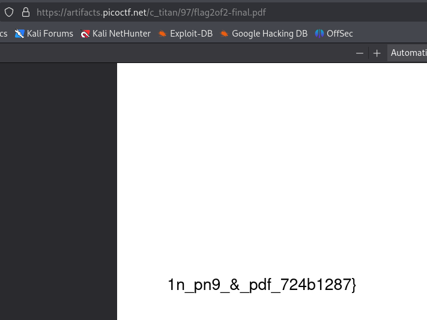
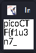

---

Opening the file, we see that it is a pdf and has this content, looks like the final part of the flag:



```
1n_pn9_&_pdf_724b1287}
```

Running a `file` command on the download file, we get that it is an image:
```bash
└─$ file flag2of2-final.pdf 
flag2of2-final.pdf: PNG image data, 50 x 50, 8-bit/color RGBA, non-interlaced
```

Trying to open this file with an image viewer by right clicking and choosing `open with`, we get the first part of the flag:


```
picoCTF{f1u3n7_
```

Constructing the flag from the parts we found:
```
picoCTF{f1u3n7_1n_pn9_&_pdf_724b1287}
```

---
