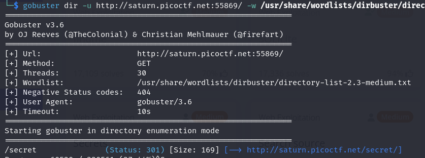
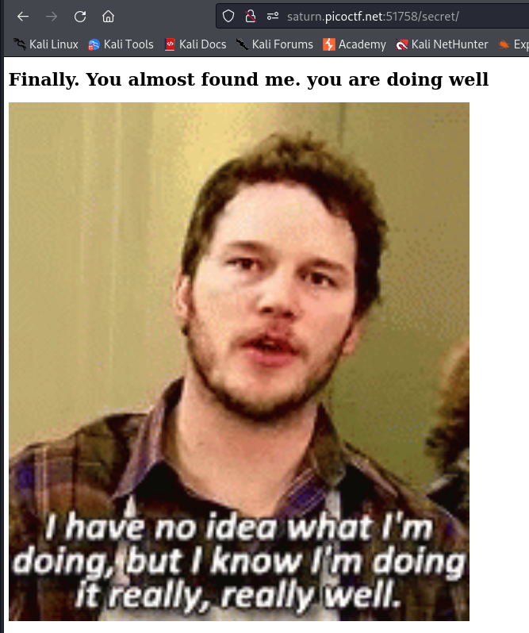
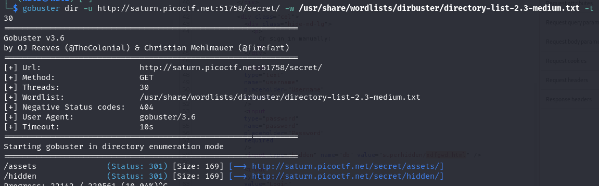
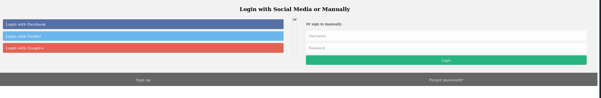
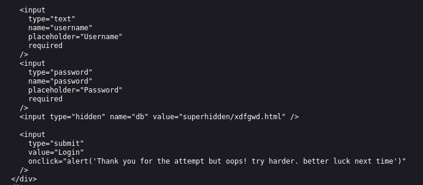
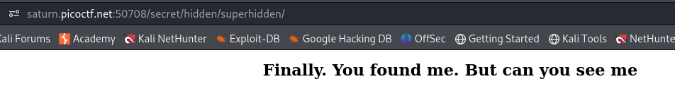
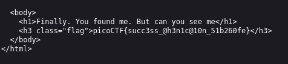

---

Opening the website, we see there is nothing special in the source code or any vulnerable injection point.
- The next step would be to enumerate for any other files or folders.

```bash
gobuster dir -u http://saturn.picoctf.net:55869/ -w /usr/share/wordlists/dirbuster/directory-list-2.3-medium.txt -t 30
```
- Use the `gobuster` tool and the given wordlist to enumerate for files.
- I added the `-t 30` argument so that it is faster.

> After some while, something pops up.



The `/secret/` directory is returned, so I opened it.



Once again, there is nothing special in this page, so I enumerated for more files using the same command as above, but starting from the `/secret/` directory.

```bash
gobuster dir -u http://saturn.picoctf.net:55869/secret/ -w /usr/share/wordlists/dirbuster/directory-list-2.3-medium.txt -t 30
```



We see that 2 folders are returned, the `/assets/` and the `/hidden/` directories.
- Opening the `/hidden/` folder, we see a login page.



However, nothing works when anything is clicked, and when the source code is viewed, there is nothing happening except a hardcoded `alert()` function that pops up when the `login` button is pressed.

> Looking deeper in the source code, we see the `/superhidden/` directory.



Opening the `/superhidden/` directory:;



Opening the source code to see the flag:



The flag:
```text
picoCTF{succ3ss_@h3n1c@10n_51b260fe}
```

---
