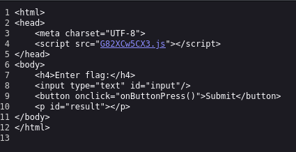
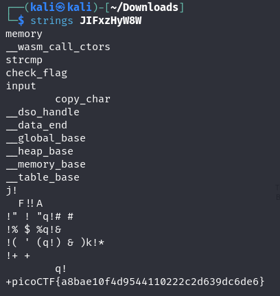

---

Opening the link, we see nothing special, however, the source code for the page is interesting.



We see there is a JavaScript file that is linked, so we open it; `/G82XCw5CX3.js`.


We see there is a long file containing obfuscated JavaScript code.
- Copying this code into a de-obfuscator to better study the content.

```JavaScript
const _0x402c = [
  'value',
  '2wfTpTR',
  'instantiate',
  '275341bEPcme',
  'innerHTML',
  '1195047NznhZg',
  '1qfevql',
  'input',
  '1699808QuoWhA',
  'Correct!',
  'check_flag',
  'Incorrect!',
  './JIFxzHyW8W',
  '23SMpAuA',
  '802698XOMSrr',
  'charCodeAt',
  '474547vVoGDO',
  'getElementById',
  'instance',
  'copy_char',
  '43591XxcWUl',
  '504454llVtzW',
  'arrayBuffer',
  '2NIQmVj',
  'result',
]
const _0x4e0e = function (_0x553839, _0x53c021) {
  _0x553839 = _0x553839 - 470
  let _0x402c6f = _0x402c[_0x553839]
  return _0x402c6f
}
;(function (_0x76dd13, _0x3dfcae) {
  const _0x371ac6 = _0x4e0e
  while (true) {
    try {
      const _0x478583 =
        -parseInt(_0x371ac6(491)) +
        parseInt(_0x371ac6(493)) +
        -parseInt(_0x371ac6(475)) * -parseInt(_0x371ac6(473)) +
        -parseInt(_0x371ac6(482)) * -parseInt(_0x371ac6(483)) +
        -parseInt(_0x371ac6(478)) * parseInt(_0x371ac6(480)) +
        parseInt(_0x371ac6(472)) * parseInt(_0x371ac6(490)) +
        -parseInt(_0x371ac6(485))
      if (_0x478583 === _0x3dfcae) {
        break
      } else {
        _0x76dd13.push(_0x76dd13.shift())
      }
    } catch (_0x41d31a) {
      _0x76dd13.push(_0x76dd13.shift())
    }
  }
})(_0x402c, 627907)
let exports
;(async () => {
  const _0x48c3be = _0x4e0e
  let _0x5f0229 = await fetch(_0x48c3be(489)),
    _0x1d99e9 = await WebAssembly[_0x48c3be(479)](
      await _0x5f0229[_0x48c3be(474)]()
    ),
    _0x1f8628 = _0x1d99e9[_0x48c3be(470)]
  exports = _0x1f8628.exports
})()
function onButtonPress() {
  const _0xa80748 = _0x4e0e
  let _0x3761f8 = document.getElementById(_0xa80748(484))[_0xa80748(477)]
  for (let _0x16c626 = 0; _0x16c626 < _0x3761f8.length; _0x16c626++) {
    exports[_0xa80748(471)](_0x3761f8[_0xa80748(492)](_0x16c626), _0x16c626)
  }
  exports.copy_char(0, _0x3761f8.length)
  exports[_0xa80748(487)]() == 1
    ? (document[_0xa80748(494)](_0xa80748(476))[_0xa80748(481)] =
        _0xa80748(486))
    : (document[_0xa80748(494)](_0xa80748(476))[_0xa80748(481)] =
        _0xa80748(488))
}
```

Observing the code, we notice that there is an array holding some values.
- I don't really understand what's going on here, but I notice there is the name of the file: `./JIFxzHyW8W`.

Checking the file, we notice that it is an assembly file.


To open and read the content of assembly files, we can use the `strings` command.



We see that the flag is returned.

```text
picoCTF{a8bae10f4d9544110222c2d639dc6de6}
```

---
