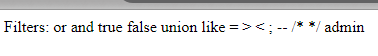
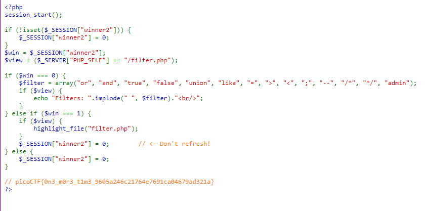

---

Opening the `filter.php` page, we see the blacklist that we need to bypass.



> We need to try and login using SQL injection and find a way to bypass the blacklist.

After a while, I deduced that there is nothing I enter in the username input alone will help us bypass this login page.
- That means, I have to add payloads in both username and password fields.

I need to figure out a way to enter `admin` in the username, and since there is an `AND` statement that we cannot remove, make the right hand side of the query evaluate to true.

Moreover, we cannot escape any single quotes, i.e., any input we add must be within the 2 quotes that are already present in the query in order to stay within valid syntax, for example:

```SQL
SELECT * FROM users WHERE username = ' ' AND password = ' ';
```
- To inject here, I must first close off the first quote, add my payload, and then somehow close off the trailing quote without causing a syntax error.
- We know that there are 2 quotes, one at the beginning, and one at the end. So the payload we use, we can remove the first quote and the last quote, and use the ones already provided.
- A payload to work would look like this: `' or '1'='1`. Here, i closed off the username, added my `or`, and then added the `'1'='1` but left out the final single quote which will be closed off by the one already present in the SQL query. 
- Pasting the payload inside the empty space in the username and password input fields we get this valid statement:
```SQL
SELECT * FROM users WHERE username = '' or '1'='1' AND password = '' or '1'='1';
```

> Since the comments and the semi-colon is filtered, we cannot escape the `AND`. Plus, we cannot remove any extra single quotes, that is, the password and the username inputs must be within the 2 quotes that are in the query.

However, the keywords `true`, `false`, and the `=` sign are black-listed, so we need to find a way to produce a `TRUE` at the right hand side.
- This can be done by using `IS` and `NOT`, which aren't blacklisted.

> We can say something like `'1' IS NOT '2'`, and that always evaluates to true.

As a result, we can try this in the username to put the word `admin` using string concatenation because it is blacklisted:
```SQL
ad'||'min
```
- Here we are mindful of the quotes, and we did not add one at the beginning or the end as explained above.

And for the password, we can use the `IS NOT` syntax:
```SQL
1' IS NOT '2
```
- As well, mindful of the quotes.

> Submitting this works, and we get the flag in the `filter.php` page.



We see the flag:

```text
picoCTF{0n3_m0r3_t1m3_9605a246c21764e7691ca04679ad321a}
```

---
