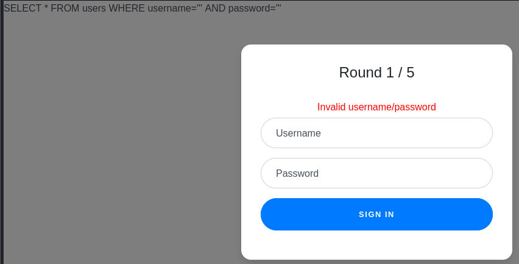
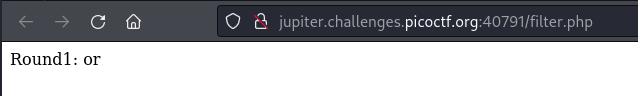
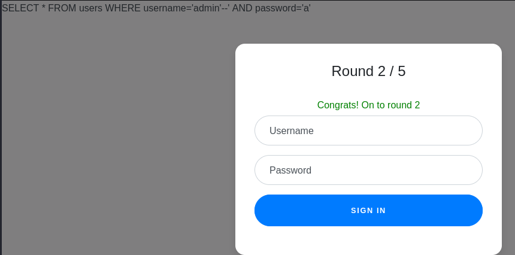
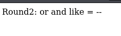
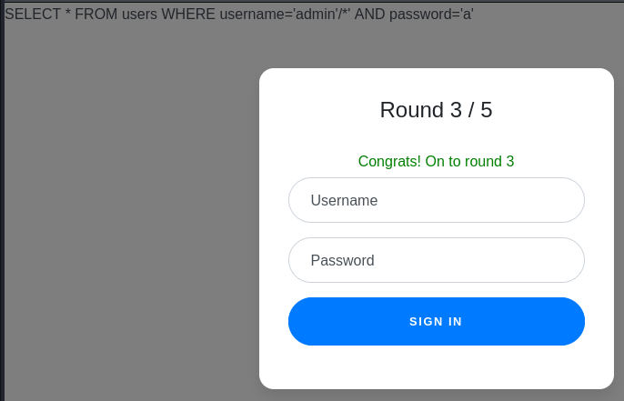
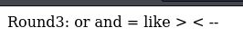
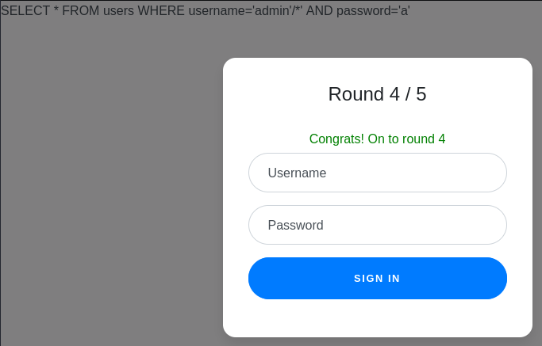
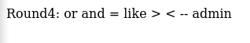
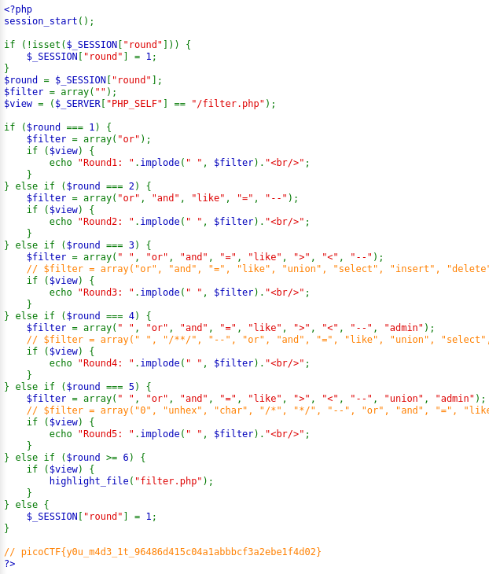

---

Opening the `index.php` login page, we are presented with two input fields.
- Trying to enter `'` the single quote to test the website gives an error, and displays the SQL query being used.



Opening the `filter.php` page, we see that it details the words that are blacklisted, or filtered.



> Given this information, it looks like we need to pass 5 rounds of logging in, while bypassing the filter for that round while logging in as `admin`.

##### Round 1

Since we cannot use `or`, lets try to specify the username as `admin` and break off the remainder of the query.

```SQL
admin'--
```



It works, and now we are in round 2.

##### Round 2

For round 2, the filters are as follows:



The filter here adds more words to the blacklist, but the only thing we actually need that is filtered is the `--` comment.
- We want to try and use the same payload as Round 1, so let's try using a different type of comment.

```SQL
admin'/*
```



##### Round 3

Opening the filter page:



Once again, the only thing that matters is the comment, and we managed to bypass this filter in round 2.
- Trying the same payload:

```SQL
admin'/*
```



##### Round 4

The filters for this round:



The only difference here is that the `admin` is filtered, so we can try bypassing this by using concatenation:

```SQL
ad'||'min'/*
```

This works and bypasses the filter, and we move on to the next round.

##### Round 5

Doing the same payload as the last round also works, and we bypass the filter.

> Opening the `filter.php` page, we see the flag and the filters being used.



The flag:

```text
picoCTF{y0u_m4d3_1t_96486d415c04a1abbbcf3a2ebe1f4d02}
```

---
