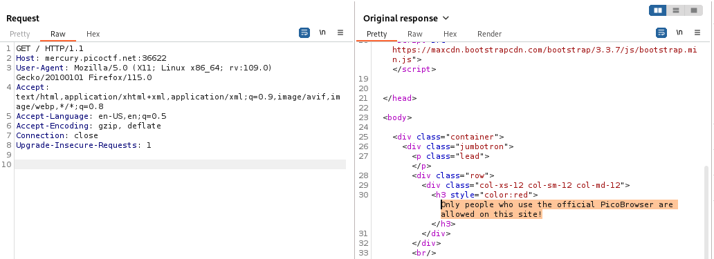
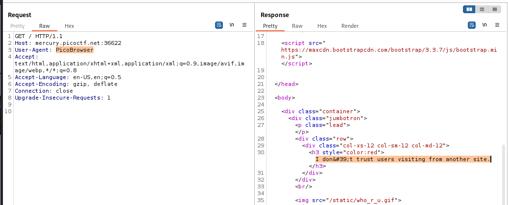
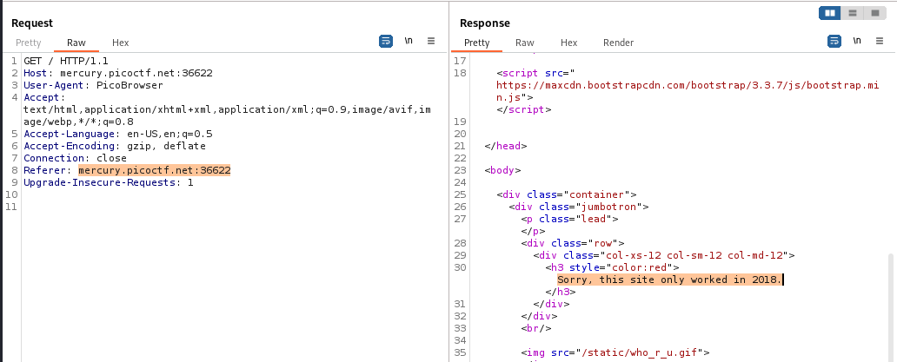
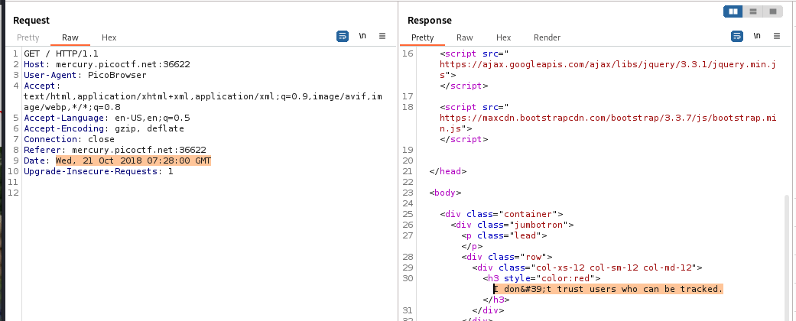
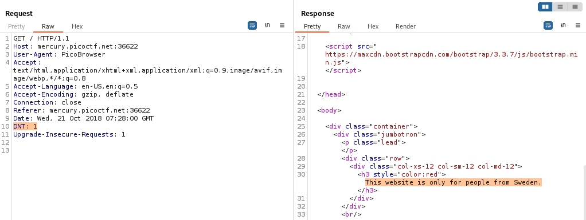
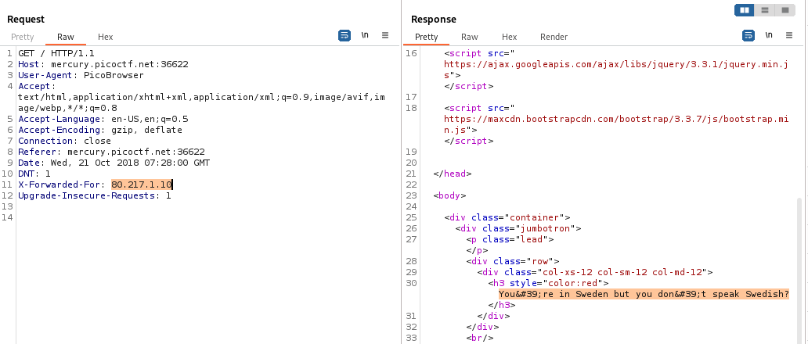
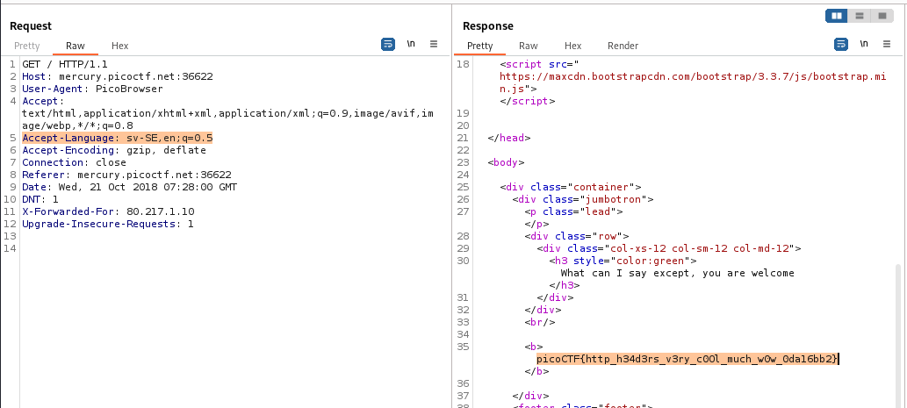

---

Opening the link and having Burp Suite Proxy HTTP History open, we can observe all the response-request pairs and change the data we need.
- After looking through the website and the source code, it looks like there is nothing to exploit, except for the information that is provided.



> Opening the first page tells us that only people who use the `PicoBrowser` are trusted.

This hints that the website checks which type of browser the client is visiting requesting from, which is the value of the `User-Agent` header.
- Let's send this request to Repeater, and then change the value of the `User-Agent` header to `PicoBrowser`.



Once we send the request with the new header, we see that we are directed to another page.

> We now understand that we need to change values in the headers depending on the information returned in the response.

Now, we need to find a header that tells tells the server that the request is coming from the same site, `mercury.picoctf.net:36622`.
- The `Referer` header can be used for that purpose.



Now, we need to change the date of the request such that it is in 2018.
- The header `Date` can be used here.



Now, we need to close off tracking, which can be done by the `DNT` header.
- Setting the `DNT` header to `1` means that the user does not want to be tracked.



Now, we need a header that makes the request look like it originates from Sweden.
- Using the `X-Forwarded-For` header can be used to give the client an IP address.
- Searching for an IP address that is Swedish, it turns out an IP in the range between `8.217.1.0-8.217.1.255` is Swedish.



Now, we need to change the language to Swedish, which can be done by modifying the `Accept-Language` header.
- Checking out the language code for the Swedish language, it is `sv-SE`.



Sending that, we get the flag:

```text
picoCTF{http_h34d3rs_v3ry_c0Ol_much_w0w_0da16bb2}
```

---
