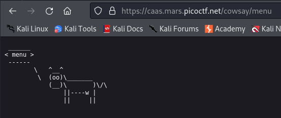
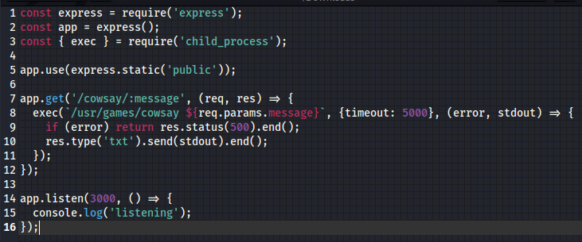
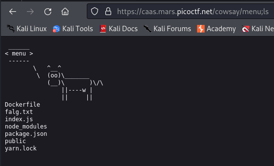
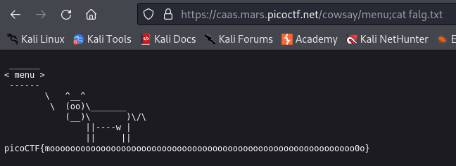

---

Opening the website, we see that it tells us to send a request to:

```url
https://caas.mars.picoctf.net/cowsay/{message} 
```

> The `{message}` is a variable that will be placed in the path, and anything we enter in the path is printed in the website.



Opening the source code `index.js` file:



> The code runs the `exec` function on `/usr/games/cowsay` and takes with it the input variable in the path as an argument, and then prints the output. So in our case when we entered `menu`, it simply printed the word `menu`, so we can assume that the `cowsay` executable draws this cow and prints the argument that is given to it.

Directly, we spot a command injection vulnerability, where we can inject code if the input that we can give by sending a request with the path is not sanitized.
- We can enter a special character like `&` or `;` to break off the first part of the command, and then enter our own command to execute whatever we want.
- So we can run the `cowsay` executable, and then run the second command of our choice.

> However, if the payload we enter is not syntactically correct, it might break the page, or not return any output at all, so we need to keep trying until something works.



After trying several characters, the `;` semi-colon is the one that works. We can think of it like this:

```javascript
exec('/usr/games/cowsay/menu;ls')
```
- We can think of this as executing 2 commands after one another, the first command executes the `cosway` command with the `menu` argument, and the second runs the `ls` command.

> Now, we can print the content of the `falg.txt` file by entering this as the path.

```text
menu;cat falg.txt
```



The flag is:
```text
picoCTF{moooooooooooooooooooooooooooooooooooooooooooooooooooooooooooo0o}
```

---
