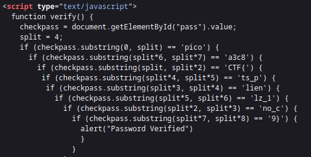

----


> Observing the source code for this challenge, we see this JS script to check for the password.



> We see the flag but divided into substrings of 4 characters each.

> Combining the substrings in order gives the flag.

```
flag: picoCTF{no_clients_plz_1a3c89}
```

---
